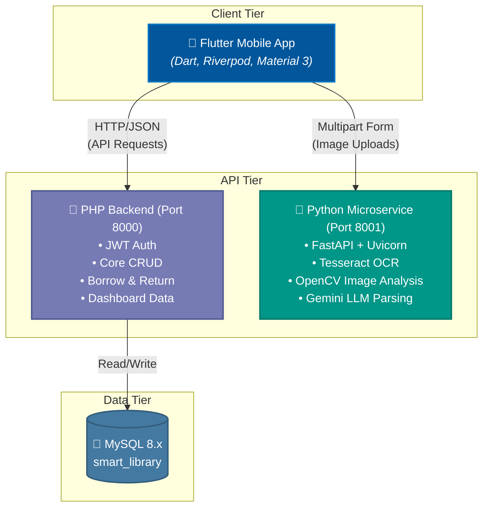
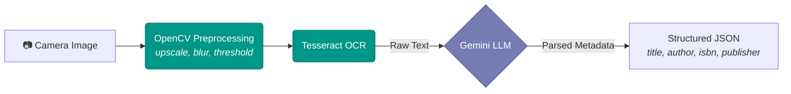
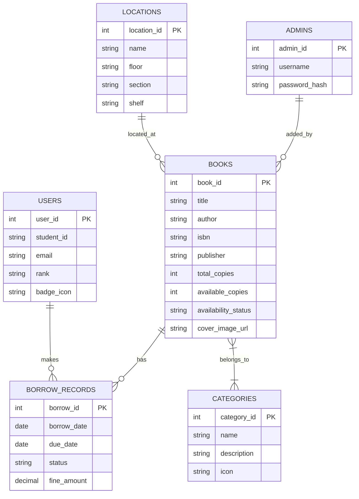

# 📚 Smart Library Management System

> An AI-powered mobile library management application built with **Flutter**, a **PHP REST API** backend, and a **Python FastAPI** computer-vision microservice. Students scan book covers with their phone camera, and the system uses OCR + LLM parsing to auto-populate book metadata — making cataloguing effortless.


---

## 📖 Table of Contents

- [🎯 Project Overview](#-project-overview)
- [🏗 Architecture](#-architecture)
- [🎨 UI/UX Design](#-uiux-design)
- [⚙ Backend — PHP (CRUD & Auth)](#-backend--php-crud--auth)
- [🐍 Backend — Python (AI/Vision)](#-backend--python-aivision)
- [🗄 Database Schema](#-database-schema)
- [📋 Prerequisites](#-prerequisites)
- [🚀 Installation & Setup](#-installation--setup)
- [⚙ Configuration](#-configuration)
- [📱 Usage Guide](#-usage-guide)
- [🧪 Testing](#-testing)
- [🚢 Deployment](#-deployment)
- [🛡 Security & Production Readiness](#-security--production-readiness)
- [🔮 Future Enhancements](#-future-enhancements)
- [🤝 Contributing](#-contributing)
- [📄 License](#-license)

---

## 🎯 Project Overview

The **Smart Library Management System** is a full-stack mobile application that digitises library operations for educational institutions. It enables:

- **Students** to browse, search, borrow, and return books via a polished mobile UI.
- **Librarians** to manage physical inventory across library floors/shelves, add books by scanning covers (AI-powered OCR), and monitor overdue items.
- **AI-Powered Cataloguing** — point the camera at a book cover and the system extracts title, author, ISBN, and publisher automatically using Tesseract OCR + Google Gemini LLM parsing.

| Feature | Description |
|---|---|
| 📱 Cross-platform Flutter app | Android, iOS, Web, Desktop |
| 🔍 AI Book Scanner | OCR + LLM extracts metadata from cover photos |
| 📚 Physical Shelf Tracking | Maps books to exact locations (floor, section, shelf) and tracks multiple copies |
| 📊 Dashboard | Real-time stats, active reads, featured books, categories |
| 🔐 Dual-role auth | Student login + Librarian login with JWT & Refresh Tokens |
| 🎨 Light & Dark themes | Modern glassmorphism UI with smooth animations |

---

## 🏗 Architecture



Both backends authenticate requests via a secure combination of `X-API-Key` headers and **JWT access/refresh tokens**.

---

## 🎨 UI/UX Design

### Design Approach

- **Framework**: Flutter with Material 3 (`useMaterial3: true`)
- **Typography**: [Google Fonts — Inter](https://fonts.google.com/specimen/Inter) for clean, modern readability
- **State Management**: [Riverpod](https://riverpod.dev/) (providers + `FutureProvider` for async API data)
- **Animations**: `animate_do` package — `FadeInDown`, `FadeInRight`, `Pulse` for micro-interactions
- **Image Handling**: `cached_network_image` prevents network spam and improves load times significantly.

### Key Design Principles

| Principle | Implementation |
|---|---|
| **Glassmorphism** | Semi-transparent cards with subtle borders and backdrop effects |
| **Light Theme** | Off-white `#F8F9FA` background, cyan `#06B6D4` accent, soft shadows |
| **Responsive Layout** | `CustomScrollView` + `SliverToBoxAdapter` for fluid scrolling |
| **Progressive Loading** | Shimmer/skeleton loaders via Riverpod's `.when()` pattern |
| **Gamification** | Reader rank system (Bronze → Silver → Gold) based on borrow count |

### App Screens

| Screen | Description |
|---|---|
| Onboarding | Animated walkthrough for first-time users |
| Login | Dual-role login (Student ID / Librarian username) |
| Dashboard | Greeting, search bar, featured carousel, categories, stat cards |
| Scanner | Camera-based book cover scanner with OCR extraction |
| Book Details | Cover art, physical shelf location, availability, editable fields |
| My Library | Borrow history with status chips (Borrowed / Returned / Overdue) |
| Profile | User stats, rank badge, account info |

---

## ⚙ Backend — PHP (CRUD & Auth)

**Architecture**: Vanilla PHP 8.x with PDO MySQL — no framework overhead. Each endpoint is a standalone script dispatched via `?action=` query parameter.

**Server**: PHP built-in development server (`php -S 0.0.0.0:8000`)

### API Endpoints

#### `user.php` — Student Authentication & Search

| Method | Action | Description |
|---|---|---|
| 🔵 **`POST`** | `?action=login` | Authenticate via `student_id` + `password` (bcrypt) |
| 🟢 **`GET`** | `?action=profile&user_id=` | Profile stats: name, email, total borrowed, rank |
| 🟢 **`GET`** | `?action=search&q=` | `FULLTEXT` search across books (title, author, ISBN) |

#### `admin.php` — Librarian Operations

| Method | Action | Description |
|---|---|---|
| 🔵 **`POST`** | `?action=login` | Librarian authentication via `username` + `password` |
| 🔵 **`POST`** | `?action=add_book` | Add book to inventory with location IDs and quantities |
| 🟠 **`PUT`** | `?action=update_book&book_id=` | Update book metadata and stock |
| 🟢 **`GET`** | `?action=all_books` | List entire inventory with stock amounts |
| 🟢 **`GET`** | `?action=all_users` | List all registered students |
| 🟠 **`PUT`** | `?action=toggle_user&user_id=` | Activate/suspend a student account |

#### `borrow.php` — Checkout & Returns

| Method | Action | Description |
|---|---|---|
| 🔵 **`POST`** | `?action=borrow` | Borrow a book (14-day loan, transactional) |
| 🔵 **`POST`** | `?action=return` | Return a borrowed book |
| 🟢 **`GET`** | `?action=history&user_id=` | Full borrow history for a user |

#### `get_dashboard.php` — Dashboard Data

| Method | Action | Description |
|---|---|---|
| 🟢 **`GET`** | `?action=stats` | Global stats (total books, active borrows, overdue) |
| 🟢 **`GET`** | `?action=user_dashboard&user_id=` | Per-user dashboard (active reads, rank, notifications) |
| 🟢 **`GET`** | `?action=featured_books` | Latest 5 books for the featured carousel |
| 🟢 **`GET`** | `?action=categories` | Book categories with icon mappings |

#### `book_details.php` — Single Book Details

| Method | Params | Description |
|---|---|---|
| 🟢 **`GET`** | `?book_id=` | Full book details + last 10 borrow history entries |

#### `categories.php` — Categories Management

| Method | Action | Description |
|---|---|---|
| 🟢 **`GET`** | `?action=list` | List all available categories and book counts |
| 🟢 **`GET`** | `?action=books&category_id=` | List all books belonging to a specific category |
| 🔵 **`POST`** | `?action=create` | (Admin) Create a new category |
| 🟠 **`PUT`** | `?action=update&id=` | (Admin) Update a category |
| 🔴 **`DELETE`** | `?action=delete&id=` | (Admin) Delete a category |

### Authentication

- **API Key**: Base requests require `X-API-Key: LIBRARY_SECRET_API_KEY_2026` header
- **JWT**: Stateless session management via JSON Web Tokens (Access + Refresh tokens securely handled in Flutter interceptors).
- **Password Hashing**: bcrypt via `password_hash()` / `password_verify()`

---

## 🐍 Backend — Python (AI/Vision)

**Framework**: FastAPI 0.115 with Uvicorn ASGI server

**Purpose**: Dedicated microservice for AI image processing — fully decoupled from CRUD operations.

### API Endpoints

| Method | Endpoint | Description |
|---|---|---|
| `GET` | `/` | Health check — lists available endpoints |
| `POST` | `/api/scan-book` | OCR + LLM: extracts title, author, ISBN, publisher from cover image |
| `POST` | `/api/analyze-cover` | Image quality metrics: sharpness, dominant colors, keypoint count |
| `POST` | `/api/detect-spines` | Shelf scanning — detects individual book spines via edge detection |

### Vision Modules

| Module | Technology | Purpose |
|---|---|---|
| `ocr_engine.py` | OpenCV + Tesseract | Image preprocessing (upscale, grayscale, threshold) → OCR text extraction |
| `llm_parser.py` | Google Gemini API | Parses raw OCR text into structured book metadata |
| `feature_matcher.py` | OpenCV (ORB/SIFT) | Cover quality analysis, dominant color extraction, spine detection |

### ML Pipeline



---

## 🗄 Database Schema

MySQL 8.x — `smart_library` database with core tables updated for physical tracking:



Indexes: **`FULLTEXT` index** on `books(title, author, isbn)` for blazing fast keyword searches; composite indexes on `borrow_records` for efficient status queries; junction table indexing for fast category filtering.

---

## 📋 Prerequisites

| Dependency | Version | Purpose |
|---|---|---|
| Flutter SDK | ≥ 3.12 | Mobile app framework |
| Dart | ≥ 3.12.2 | Programming language |
| PHP | ≥ 8.0 | CRUD backend |
| Python | ≥ 3.9 | AI/Vision backend |
| MySQL | ≥ 8.0 | Database |
| Tesseract OCR | ≥ 5.0 | Text recognition engine |
| Android Studio / Xcode | Latest | Emulators & build tools |

---

## 🚀 Installation & Setup

### 1. Clone the Repository

```bash
git clone https://github.com/your-username/Smart-Library-Management-System.git
cd Smart-Library-Management-System
```

### 2. Database Setup

```bash
# Start MySQL and import the fully updated schema
mysql -u root -p < backend/current_database_schema.sql

# OR use the automated setup script (starts PHP server first):
php -S 0.0.0.0:8000 -t backend/php_backend
# Then visit: http://localhost:8000/api/setup.php
```

### 3. PHP Backend (Port 8000)

```bash
cd backend/php_backend
php -S 0.0.0.0:8000
```

> **Note**: Bind to `0.0.0.0` so mobile emulators and physical devices can connect.

### 4. Python Backend (Port 8001)

```bash
cd backend/py_backend
pip install -r requirements.txt
python main.py
```

> **Tesseract**: Ensure Tesseract OCR is installed and the path in `ocr_engine.py` matches your installation.

### 5. Flutter App

```bash
cd smart_library_app
flutter pub get
flutter run
```

---

## ⚙ Configuration

### Environment Variables

**Python Backend** (`backend/py_backend/.env`):

```env
MYSQL_HOST=localhost
MYSQL_USER=root
MYSQL_PASSWORD=
MYSQL_DATABASE=smart_library
```

**PHP Backend** — constants in `api/db_connect.php`:

```php
define('DB_HOST', '127.0.0.1');
define('DB_NAME', 'smart_library');
define('DB_USER', 'root');
define('DB_PASS', '');
define('API_KEY', 'LIBRARY_SECRET_API_KEY_2026');
```

**Flutter App** — `lib/core/app_constants.dart`:

- Android Emulator host: `10.0.2.2`
- iOS Simulator: `127.0.0.1`
- Physical device: Replace with your machine's LAN IP (`ipconfig`)

---

## 📱 Usage Guide

### Default Credentials

| Role | ID / Username | Password |
|---|---|---|
| Student | `S12345` | `password123` |
| Student | `S67890` | `password123` |
| Librarian | `librarian` | `password123` |

### Workflow

1. **Launch** the app → complete the onboarding carousel
2. **Login** as a Student or Librarian
3. **Dashboard** shows greeting, stats, featured books, and categories
4. **Search** books by title, author, or ISBN
5. **Scan** a book cover using the camera (Scanner FAB button)
6. **Review** the AI-extracted metadata, assign a physical shelf location, and confirm to add to inventory
7. **Borrow/Return** books from the Library screen

---

## 🧪 Testing

### Backend API Testing

```bash
# Health check
curl http://localhost:8000/api/get_dashboard.php?action=stats \
  -H "X-API-Key: LIBRARY_SECRET_API_KEY_2026"

# Student login
curl -X POST http://localhost:8000/api/user.php?action=login \
  -H "Content-Type: application/json" \
  -H "X-API-Key: LIBRARY_SECRET_API_KEY_2026" \
  -d '{"student_id": "S12345", "password": "password123"}'

# Python health check
curl http://localhost:8001/
```

### Flutter Tests

```bash
cd smart_library_app
flutter test
flutter analyze
```

---

## 🚢 Deployment

> **Status**: The project is in **early development stage**. The steps below outline a production deployment path.

1. **Database**: Migrate to a managed MySQL instance (AWS RDS, PlanetScale, etc.)
2. **PHP Backend**: Deploy behind Nginx/Apache with PHP-FPM; update `DB_*` constants and `API_KEY`
3. **Python Backend**: Containerise with Docker; deploy to a GPU-enabled instance if scaling ML inference
4. **Flutter App**: Build release APK/IPA:
   ```bash
   flutter build apk --release
   flutter build ios --release
   ```
5. **Secrets**: Move all API keys and credentials to environment variables — never commit to source control

---

## 🛡 Security & Production Readiness

This project was built for academic demonstration. The following production-level enhancements have been applied or identified:

- ✅ **Authentication**: Migrated from static `X-API-Key` to JSON Web Tokens (JWT) for secure, stateless user sessions with automated refresh flows.
- ✅ **Database Indexing**: Deployed MySQL `FULLTEXT` indices for robust, scalable title/author search capabilities.
- ✅ **Asset Loading Optimization**: Flutter image delivery upgraded to `CachedNetworkImage` to reduce network loads.
- 🚧 **Transport Security**: Deploy behind an API gateway (e.g., Nginx) with HTTPS/TLS to encrypt data in transit.
- 🚧 **Rate Limiting**: Implement API rate limiting to prevent brute-force attacks on login endpoints.
- 🚧 **Environment Variables**: Extract hardcoded credentials and API keys into a secure environment file or vault.
- 🚧 **AI Scalability**: Containerise the Python FastAPI backend and deploy with Gunicorn/Uvicorn workers to handle concurrent OCR processing.

---

## 🔮 Future Enhancements

- [x] **JWT Authentication** — implemented with seamless flutter `Dio` interceptors
- [x] **Physical Library Tracking** — advanced database relationships tracking shelves, sections, and copy amounts
- [x] **FULLTEXT Database Optimization** — lightning-fast boolean mode searches
- [ ] **Push Notifications** — overdue reminders via Firebase Cloud Messaging
- [ ] **Book Recommendations** — collaborative filtering based on borrow history
- [ ] **Barcode/QR Scanning** — ISBN barcode reader for faster cataloguing
- [ ] **Admin Dashboard (Web)** — a web-based admin panel for librarians
- [ ] **Offline Mode** — local SQLite cache with background sync
- [ ] **Image CDN** — serve book cover images via a CDN instead of local paths

---

## 📝 Changelog

- **[June 2026] Database Architecture Upgrades**: Implemented a comprehensive `locations` tracking system and multi-copy tracking for physical books. Built full SQL schema backups.
- **[June 2026] Security & Speed**: Introduced JWT token refresh authentication strategy, `FULLTEXT` indexing on books, and Flutter asset caching layers (`CachedNetworkImage`).
- **[June 2026] Architecture Review**: Completed a comprehensive architecture review, identifying key scalability bottlenecks and security improvements for production readiness.
- **[June 2026] Flutter UI Fixes**: 
  - Resolved `Constant evaluation error` in `main_screen.dart` and `dashboard_screen.dart` by removing `const` keywords from widgets using dynamic `AppColors`.
  - Updated `CardTheme` to `CardThemeData` in `app_theme.dart` for newer Flutter SDK compatibility.
  - Corrected `ThemeModeNotifier` calls in `account_settings_screen.dart` to fix `setTheme` undefined errors.

---

## 🤝 Contributing

Contributions are welcome! Please follow these steps:

1. **Fork** the repository
2. **Create** a feature branch: `git checkout -b feature/amazing-feature`
3. **Commit** your changes: `git commit -m "Add amazing feature"`
4. **Push** to the branch: `git push origin feature/amazing-feature`
5. **Open** a Pull Request

### Code Style

- **Dart**: Follow [Effective Dart](https://dart.dev/effective-dart) guidelines + `flutter_lints`
- **PHP**: PSR-12 coding standard; always use prepared statements
- **Python**: PEP 8; type hints encouraged

---

## 📄 License

This project is licensed under the **MIT License** — see the [LICENSE](LICENSE) file for details.

---

<p align="center">
  Built with ❤️ using Flutter, PHP, FastAPI, and OpenCV
</p>
