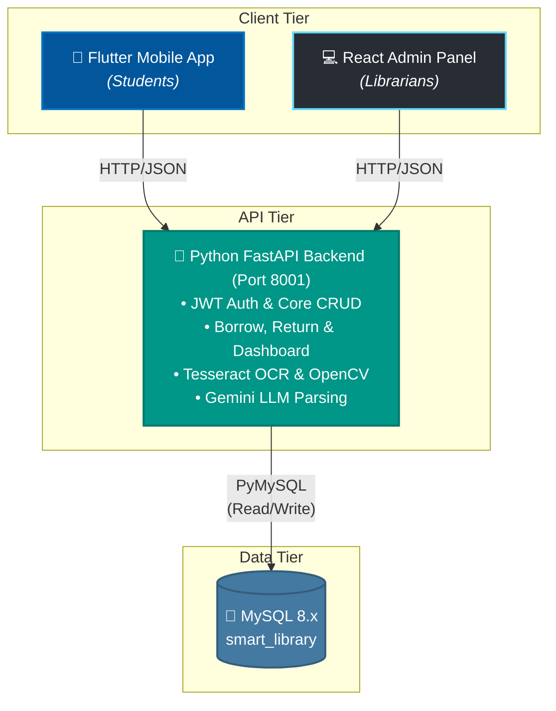
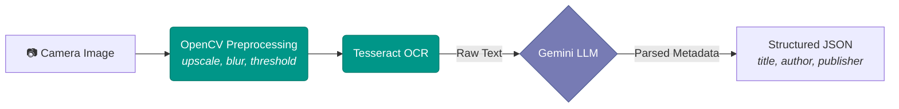

# 📚 Smart Library Management System

> An AI-powered dual-platform library management system. It features a **Flutter** mobile application for students, a **React + Vite** web admin panel for librarians, and a unified **Python FastAPI** backend for CRUD and computer-vision microservices. Students scan book covers with their phone camera, and the system uses OCR + LLM parsing to auto-populate book metadata — making cataloguing effortless.


---

## 📖 Table of Contents

- [🎯 Project Overview](#-project-overview)
- [🏗 Architecture](#-architecture)
- [🎨 UI/UX Design](#-uiux-design)
- [⚙ Backend — Python FastAPI](#-backend--python-fastapi)
- [🗄 Database Schema](#-database-schema)
- [📋 Prerequisites](#-prerequisites)
- [🚀 Installation & Setup](#-installation--setup)
- [⚙ Configuration](#-configuration)
- [📱 Usage Guide](#-usage-guide)
- [🚢 Deployment](#-deployment)
- [🛡 Security & Production Readiness](#-security--production-readiness)
- [🔮 Future Enhancements](#-future-enhancements)
- [📝 Changelog](#-changelog)
- [📄 License](#-license)

---

## 🎯 Project Overview

The **Smart Library Management System** is a full-stack dual-platform application that digitises library operations for educational institutions. It enables:

- **Students** to browse, search, borrow, and return books via a highly polished mobile UI (Flutter).
- **Librarians** to manage physical inventory, individual physical copies, locations, and view analytics using a dedicated web dashboard (React + Tailwind CSS).
- **AI-Powered Cataloguing** — point a camera at a book cover and the system automatically extracts the title, author, and publisher using Tesseract OCR combined with Google Gemini LLM parsing.

| Feature | Description |
|---|---|
| 📱 Mobile App (Flutter) | Target platform for students to manage reading lists and borrowing. |
| 💻 Admin Panel (React) | Dedicated web dashboard for librarians to manage the catalog. |
| 🔍 AI Book Scanner | OCR + LLM extraction from cover photography. |
| 📚 Physical Copy Tracking | Tracks individual book copies via unique barcodes/ISBNs linked to physical shelf coordinates. |
| 📊 Dashboard Analytics | Real-time analytics, active reads, and circulation metrics. |

---

## 🏗 Architecture



---

## 🎨 UI/UX Design

### Flutter Mobile App (Students)
- **Framework**: Flutter with Material 3.
- **Typography**: Google Fonts (Inter).
- **State Management**: Riverpod.
- **Animations**: Fluid micro-animations for interactions.

### React Admin Panel (Librarians)
- **Framework**: React 18, Vite.
- **Styling**: Tailwind CSS with Glassmorphism aesthetics.
- **Components**: Lucide React for iconography, React Hook Form + Zod for robust data entry.

---

## ⚙ Backend — Python FastAPI

**Framework**: FastAPI 0.115 with Uvicorn ASGI server
**Architecture**: A unified monolithic backend handling both RESTful CRUD operations and AI image processing for both the mobile and web clients.

### ML Pipeline



---

## 🗄 Database Schema

MySQL 8.x — `smart_library` database with core tables optimized for physical tracking. The schema treats `books` as metadata catalogs and uses a dedicated `book_copies` table to track individual physical volumes by barcode/ISBN. View the [Database Schema Reference](doc/database_schema_reference.md) for deeper details.

---

## 📋 Prerequisites

| Dependency | Version | Purpose |
|---|---|---|
| Node.js & npm | ≥ 18.x | Admin panel build and execution |
| Flutter SDK | ≥ 3.12 | Mobile app framework |
| Python | ≥ 3.9 | Monolithic backend |
| MySQL | ≥ 8.0 | Database |
| Tesseract OCR | ≥ 5.0 | Text recognition engine |

---

## 🚀 Installation & Setup

### 1. Database Setup
```bash
mysql -u root -p < backend/current_database_schema.sql
# Optional: Load sample data
mysql -u root -p smart_library < backend/sample_data.sql
```

### 2. Python Backend (Port 8001)
```bash
cd backend/py_backend
pip install -r requirements.txt
python main.py
```

### 3. React Admin Panel (Port 5173)
```bash
cd admin-panel
npm install
npm run dev
```

### 4. Flutter App
```bash
cd smart_library_app
flutter pub get
flutter run
```

---

## ⚙ Configuration

### Environment Variables
For development, API keys are configured in constants. For production, transition to an `.env` managed setup.

- **Flutter App** (`lib/core/app_constants.dart`)
- **React Admin** (`admin-panel/src/api/config.ts`)

---

## 📱 Usage Guide

### Default Credentials
| Role | ID / Username | Password | Client |
|---|---|---|---|
| Student | `S12345` | `password123` | Mobile App |
| Librarian | `librarian` | `password123` | React Admin Panel |

---

## 🚢 Deployment

> **Status**: Development.

1. **Database**: Migrate to AWS RDS / managed MySQL.
2. **Python Backend**: Containerize with Docker and deploy via Uvicorn/Gunicorn.
3. **React Web**: Build using `npm run build` and deploy statically (Vercel, Netlify, Nginx).
4. **App**: Build release binaries (`flutter build apk`).

---

## 📝 Changelog

- **[July 2026] Dual-Frontend Expansion**: Introduced a fully functional React + Vite Admin Panel for librarians, separating the administrative workflow from the student-focused Flutter mobile application.
- **[July 2026] Physical Copy Tracking**: Redesigned the database schema to track individual physical volumes (`book_copies`) using unique barcodes, replacing aggregate integer counts in the main `books` table.
- **[July 2026] Architecture Unification**: Migrated all legacy PHP CRUD endpoints into the FastAPI backend, resulting in a single, robust, and unified Python backend architecture.
- **[July 2026] Documentation Audit**: Completed a comprehensive review and rewrite of all architectural documentation reflecting the new dual-frontend structure and physical copy tracking.

---

## 📄 License

This project is licensed under the **MIT License**.

<p align="center">
  Built with ❤️ using React, Flutter, FastAPI, and OpenCV
</p>
