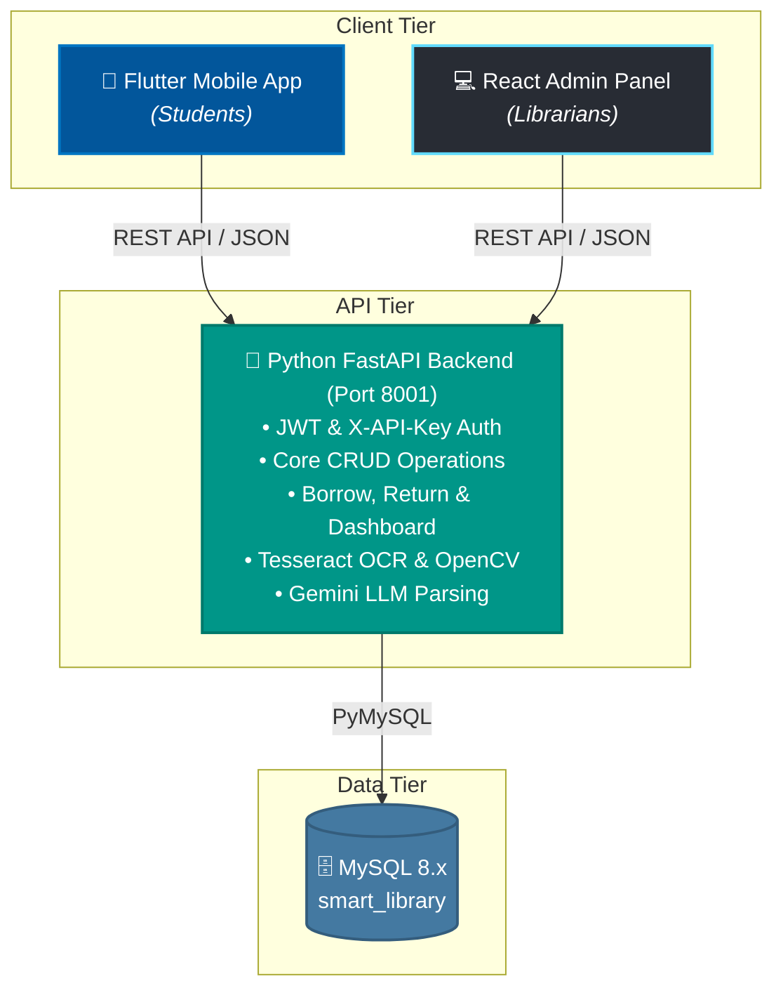
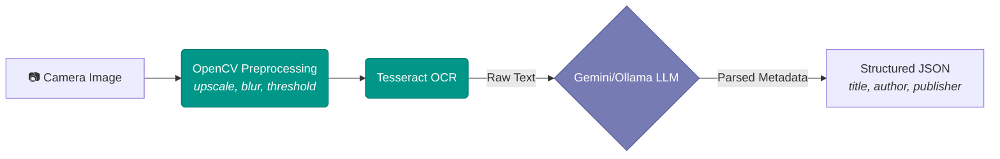

# Smart Library Management System 📚


A comprehensive, full-stack dual-platform application that digitizes library operations for educational institutions. The system bridges the gap between digital cataloging and physical library management using AI-powered tools.

---

## 📑 Table of Contents

- [Project Overview](#-project-overview)
- [Key Features](#-key-features)
- [System Architecture](#-system-architecture)
- [Project Structure](#-project-structure)
- [Dependencies](#-dependencies)
- [Database Schema](#-database-schema)
- [AI & ML Pipeline](#-ai--ml-pipeline)
- [Installation & Setup](#-installation--setup)
- [Usage Guide & Default Credentials](#-usage-guide--default-credentials)
- [Contribution Guidelines](#-contribution-guidelines)
- [License](#-license)

---

## 📖 Project Overview

The **Smart Library Management System** is built to streamline the workflow of both librarians and students. It consists of two distinct frontend applications powered by a unified monolithic API:

1. **Student Mobile App (Flutter)**: Allows students to browse the library catalog, search for books, manage their reading lists, and check borrowing history.
2. **Librarian Web Dashboard (React)**: A robust admin panel enabling library staff to manage physical inventory, process checkouts/check-ins, and view circulation analytics.

---

## ✨ Key Features

| Feature | Description |
|---|---|
| **📱 Mobile App (Flutter)** | Target platform for students to manage reading lists, borrow history, and discover new books. |
| **💻 Admin Panel (React)** | Dedicated web dashboard for librarians to manage the catalog, categories, locations, and users. |
| **🤖 AI Book Scanner** | Uses OCR (Tesseract) and LLM extraction (Google Gemini / Ollama) to automatically identify and parse book titles and authors from cover photography. |
| **📖 Physical Copy Tracking** | Treats books as general metadata entities, while tracking individual physical volumes via unique barcodes/ISBNs linked to physical shelf coordinates. |
| **📊 Dashboard Analytics** | Real-time analytics, active reads, circulation metrics, and overdue fine management. |

---

## 🏗️ System Architecture



---

## 📁 Project Structure

Here is a high-level overview of the project's layout:

- **`admin-panel/`**: Contains the React 19/Vite frontend for the Librarian web dashboard.
- **`backend/`**: Contains the core backend logic. 
  - `py_backend/`: FastAPI application code, routers, database connections, and AI vision modules.
  - Database schema scripts (`current_database_schema.sql`) and sample data seeders (`sample_data.sql`, `seed_25_books.py`).
- **`smart_library_app/`**: Contains the Flutter mobile application source code targeting student users.
- **`doc/`**: System documentation and supplementary guides.
- **`uploads/`**: Directory for handling user file uploads (e.g., book cover photos).

---

## 📦 Dependencies

### Backend (Python FastAPI)
*Defined in `backend/py_backend/requirements.txt`*
- **FastAPI** (0.115.0) & **Uvicorn** (0.30.0) for the high-performance ASGI server.
- **PyMySQL** (1.1.1) for database interactions.
- **OpenCV-Python-Headless** (4.10.0) & **Pytesseract** (0.3.13) for OCR and image processing.
- **PyJWT** (2.8.0), **Passlib** (1.7.4), & **Bcrypt** for secure authentication.

### Admin Panel (React)
*Defined in `admin-panel/package.json`*
- **React** (19.2) & **Vite** (8.1)
- **TailwindCSS** (4.3) for styling
- **Zustand** (5.0) for lightweight state management
- **React Hook Form** & **Zod** for complex form handling and validation
- **Recharts** for analytics and data visualization
- **Lucide React** for UI iconography

### Mobile App (Flutter)
*Defined in `smart_library_app/pubspec.yaml`*
- **Flutter** SDK (^3.12.2)
- **Flutter Riverpod** (^3.3.2) for state management
- **HTTP** for REST API communication
- **Image Picker** for camera integration (book scanning)
- **Google Fonts**, **Cached Network Image**, & **Shimmer** for an enhanced UI experience.

---

## 🤖 AI & ML Pipeline

The system features an automated cataloging tool that drastically reduces manual data entry. Librarians can upload or take a photo of a book cover, and the system handles the rest:



---

## 🗄️ Database Schema

The database (`smart_library`) runs on MySQL 8.x and is optimized for physical inventory tracking.

Key architectural decisions:
- The **`books`** table acts as a metadata catalog (Title, Author, Publisher, Synopsis).
- The **`book_copies`** table tracks individual physical volumes. Each copy is assigned a unique `barcode`, allowing for granular tracking of conditions, availability status, and shelf locations.
- **`total_copies`** and **`available_copies`** are automatically calculated based on the physical copies in the system.
- The **`categories`** and **`locations`** tables handle taxonomy and physical placement of resources.

*(See `backend/current_database_schema.sql` for the full schema definition).*

---

## ⚙️ Installation & Setup

### Prerequisites
- Node.js (v18.x+) & npm
- Flutter SDK (v3.12+)
- Python (v3.9+)
- MySQL (v8.0+)
- Tesseract OCR (Installed and added to system PATH)

### 1. Database Setup
```bash
# Import the schema
mysql -u root -p < backend/current_database_schema.sql

# (Optional) Load sample dummy data
mysql -u root -p smart_library < backend/sample_data.sql
```

### 2. Python Backend (Runs on Port 8001)
```bash
cd backend/py_backend
pip install -r requirements.txt

# Create a .env file and configure your database and API keys
# e.g., MYSQL_HOST=localhost, GEMINI_API_KEY=your_key

# Run the server
uvicorn main:app --port 8001 --reload
```

### 3. React Admin Panel (Runs on Port 5173)
```bash
cd admin-panel
npm install
npm run dev
```

### 4. Flutter Mobile App
```bash
cd smart_library_app
flutter pub get
flutter run
```

---

## 🔑 Usage Guide & Default Credentials

When running locally with the sample data, you can use the following default credentials to test the system:

| Role | ID / Username | Password | Application |
|---|---|---|---|
| **Student** | `S12345` | `password123` | Mobile App |
| **Librarian** | `admin` | `password123` | React Admin Panel |

---

## 🤝 Contribution Guidelines

We welcome contributions to the Smart Library Management System! 
- Please fork the repository and create a new feature branch for your work.
- Ensure that you follow the existing code styles for React, Flutter, and FastAPI respectively.
- Run any available tests and verify your changes locally before submitting a pull request.
- Make sure to update documentation and README.md if adding new features or changing architectures.

---

## 📄 License

This project is licensed under the **MIT License**.

<p align="center">
  Built with 💻 and ❤️ using React, Flutter, FastAPI, and MySQL.
</p>
