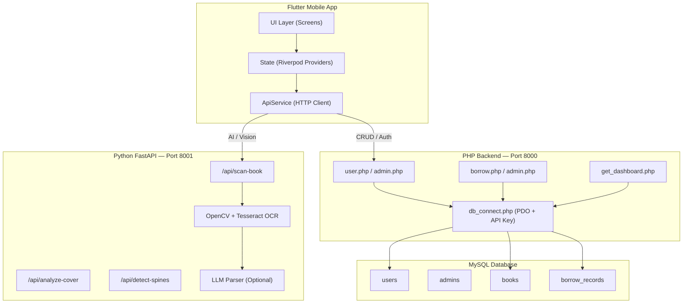
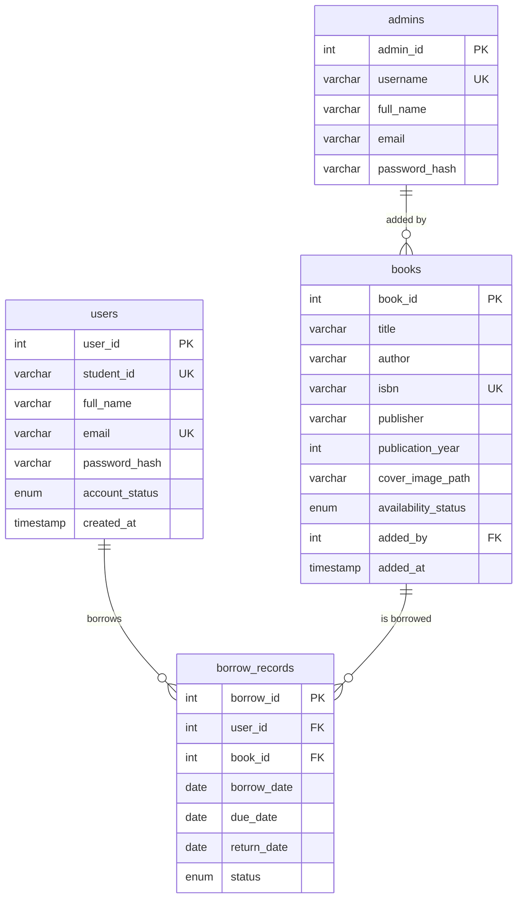
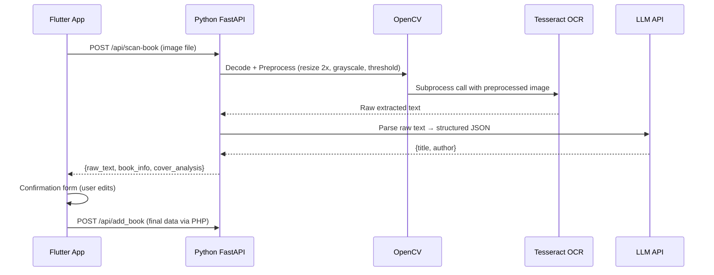
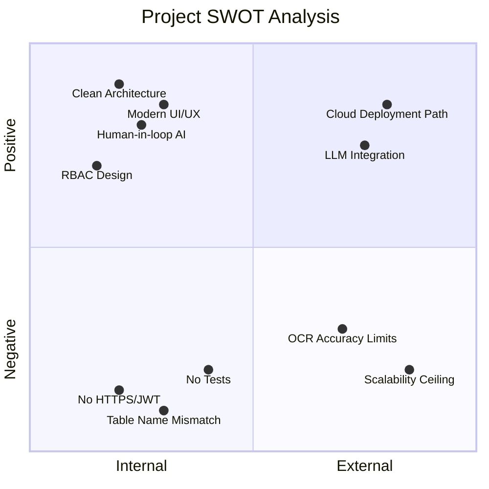

# Critical Architecture Analysis — Smart Library Management System

> **Project**: Smart Library Management Mobile Application Using Image Processing
> **Review Date**: 23 June 2026
> **Reviewer Role**: Senior Principal Software Engineer & System Architect

---

## Executive Summary

This is a **well-structured final-year project** that demonstrates competence across the full stack — mobile UI, dual-backend microservice separation, relational database design, and an AI/computer vision pipeline. The architecture cleanly separates concerns (CRUD vs. AI) across two backends, and the Flutter frontend shows strong UI/UX maturity with glassmorphism theming, micro-animations, and Riverpod state management.

However, a production-grade review surfaces several **security vulnerabilities, scalability bottlenecks, and edge-case failure points** that are important to document for academic rigor.

---

## 1. System Architecture

### 1.1 Architecture Diagram

### 1.2 Strengths

| Aspect | Assessment |
|---|---|
| **Separation of Concerns** | Excellent. CRUD (PHP) and AI (Python) are isolated on separate ports. Either service can be scaled, restarted, or replaced independently. |
| **Stateless Backends** | Both PHP and FastAPI are stateless — session data lives in Flutter's SharedPreferences. This simplifies horizontal scaling. |
| **Single Source of Truth** | All persistent state lives in one MySQL database, avoiding data synchronization problems. |
| **RBAC via Single Codebase** | Student and Librarian roles share one Flutter app with conditional UI rendering — clean and maintainable. |

### 1.3 Architectural Risks

| Risk | Severity | Detail |
|---|---|---|
| **No API Gateway** | Medium | Two separate backend URLs are hardcoded in the client. An API gateway (e.g., Nginx reverse proxy) would provide a single entry point, centralize CORS, and enable rate limiting. |
| **No Service Discovery** | Low | For a local/academic deployment this is acceptable. In production, hardcoded IPs would be replaced by DNS or service mesh. |
| **Dual-Language Backend** | Low | PHP + Python is unusual but justified here — PHP is common in academic web hosting, and Python is the ecosystem standard for OpenCV/Tesseract/LLM. The trade-off is increased DevOps complexity. |

---

## 2. Security Analysis

> [!CAUTION]
> Several findings below would be considered **critical** in a production environment. For an academic project they are acceptable with documentation, but an evaluator will look favourably on you acknowledging them.

### 2.1 Findings Table

| # | Finding | Severity | File | Detail |
|---|---|---|---|---|
| S1 | **Hardcoded API Key in Source Code** | 🔴 Critical | [app_constants.dart](file:///d:/Projects/Smart-Library-Management-System/smart_library_app/lib/core/app_constants.dart#L28) | `LIBRARY_SECRET_API_KEY_2026` is a string constant compiled into the APK. It can be trivially extracted via `apktool` or `strings`. In production, this would be fetched from a secure vault or environment variable at runtime. |
| S2 | **API Key Sent Over Plaintext HTTP** | 🔴 Critical | [api_service.dart](file:///d:/Projects/Smart-Library-Management-System/smart_library_app/lib/services/api_service.dart#L19) | All requests use `http://` not `https://`. The API key, student ID, and password travel as plaintext, vulnerable to MITM sniffing on any shared network. |
| S3 | **No Token-Based Authentication** | 🟠 High | [providers.dart](file:///d:/Projects/Smart-Library-Management-System/smart_library_app/lib/providers/providers.dart#L41-L54) | After login, the user's `user_id` is stored in SharedPreferences and sent with subsequent requests. There is no JWT or session token — any attacker who guesses a `user_id` integer can impersonate that user. |
| S4 | **No Rate Limiting** | 🟠 High | [db_connect.php](file:///d:/Projects/Smart-Library-Management-System/backend/php_backend/api/db_connect.php#L38) | The login endpoint has no brute-force protection. An attacker can attempt unlimited password combinations. |
| S5 | **Passwords in Logs** | 🟡 Medium | [ocr_engine.py](file:///d:/Projects/Smart-Library-Management-System/backend/py_backend/vision_modules/ocr_engine.py#L40-L56) | Not passwords per se, but verbose `print()` statements in the OCR engine output image shapes, file paths, and extracted text to stdout. In production, this leaks PII-adjacent data to log aggregators. |
| S6 | **Wildcard CORS** | 🟡 Medium | [db_connect.php](file:///d:/Projects/Smart-Library-Management-System/backend/php_backend/api/db_connect.php#L19) / [main.py](file:///d:/Projects/Smart-Library-Management-System/backend/py_backend/main.py#L52) | `allow_origins=["*"]` is required for local development but must be locked to specific origins in production to prevent cross-site request forgery. |
| S7 | **File Upload Without Size Limit** | 🟡 Medium | [main.py](file:///d:/Projects/Smart-Library-Management-System/backend/py_backend/main.py#L89) | `await file.read()` loads the entire upload into memory with no size cap. A 500MB file would exhaust server RAM. |

### 2.2 Recommendation Summary

For your project report, state that you are aware of these limitations and would address them in a production deployment via:
- HTTPS (TLS termination at an Nginx reverse proxy)
- JWT-based authentication replacing the static API key
- Rate limiting via middleware (e.g., `slowapi` for FastAPI, `php-rate-limiter`)
- Upload size caps (FastAPI: `UploadFile` with `max_size`, PHP: `upload_max_filesize`)

---

## 3. Database Design

### 3.1 Schema Diagram

### 3.2 Strengths

- **Proper bcrypt hashing** via `password_hash()` / `password_verify()` — industry standard.
- **Prepared statements** throughout — eliminates SQL injection risk.
- **Transactional borrow/return** — `beginTransaction()` + `commit()` in [borrow.php](file:///d:/Projects/Smart-Library-Management-System/backend/php_backend/api/borrow.php#L48-L62) prevents partial state (book marked borrowed without a borrow record).
- **Clean ENUM usage** for `account_status` (`active`/`suspended`) and `availability_status`.

### 3.3 Issues

> [!WARNING]
> **Table Name Mismatch (Will Cause Runtime Errors)**
>
> Your MySQL database has a table named `borrowed_books`, but your PHP code references `borrow_records` throughout [user.php](file:///d:/Projects/Smart-Library-Management-System/backend/php_backend/api/user.php#L87), [borrow.php](file:///d:/Projects/Smart-Library-Management-System/backend/php_backend/api/borrow.php#L52), and [get_dashboard.php](file:///d:/Projects/Smart-Library-Management-System/backend/php_backend/api/get_dashboard.php#L29). The login endpoint works because it only queries the `users` table, but **any borrow, profile, or dashboard query will fail with a PDO exception**.
>
> **Fix**: Rename the MySQL table to `borrow_records`, or update all PHP references to `borrowed_books`.

| Issue | Impact |
|---|---|
| **No indexing strategy documented** | Queries like `WHERE title LIKE '%query%'` in [user.php:136](file:///d:/Projects/Smart-Library-Management-System/backend/php_backend/api/user.php#L136) perform full table scans. Adding a `FULLTEXT` index on `(title, author, isbn)` would dramatically improve search at scale. |
| **`ON DELETE CASCADE` risk** | Deleting a user cascades to delete all their borrow history — this may violate audit requirements in a real library. `ON DELETE RESTRICT` with a soft-delete pattern would be safer. |
| **No `admins` → `books.added_by` FK constraint** | The `added_by` column has no foreign key enforcement, allowing orphaned references. |
| **Single-copy book model** | Each row in `books` represents a single copy. Real libraries have multiple copies of the same title. A `book_copies` table would separate the title metadata from physical inventory. |

---

## 4. AI / Image Processing Pipeline

### 4.1 Pipeline Flow

### 4.2 Strengths

- **Human-in-the-loop validation** — The [BookDetailsConfirmationScreen](file:///d:/Projects/Smart-Library-Management-System/smart_library_app/lib/screens/book_details_confirmation_screen.dart#L10) lets users correct AI mistakes before saving. This is critical because OCR accuracy on book covers is inherently imperfect.
- **Graceful LLM fallback** — If the LLM parser fails, the system [silently falls back](file:///d:/Projects/Smart-Library-Management-System/backend/py_backend/main.py#L104-L109) to returning raw OCR text with empty structured fields. The app doesn't crash.
- **Image quality assessment** — The [analyze_cover](file:///d:/Projects/Smart-Library-Management-System/backend/py_backend/vision_modules/feature_matcher.py#L102-L153) function uses Laplacian variance to detect blurry images and provides a `quality` rating.

### 4.3 Edge-Case Failures

| Scenario | Expected Behavior | Actual Behavior | Severity |
|---|---|---|---|
| **Very dark or low-light cover photo** | Flashlight toggle helps, but... | Fixed threshold at `150` in [ocr_engine.py:55](file:///d:/Projects/Smart-Library-Management-System/backend/py_backend/vision_modules/ocr_engine.py#L55) fails on dark covers. **Adaptive thresholding** (`cv2.adaptiveThreshold`) would be more robust. | 🟠 High |
| **Non-English book covers** | Should extract text | Tesseract defaults to English (`--psm 6 --oem 3`). No `--lang` flag is passed. Non-Latin scripts (Sinhala, Tamil, Arabic) will produce garbage. | 🟠 High |
| **Rotated or skewed covers** | Should deskew | No perspective correction or deskew step. A tilted photo will degrade OCR accuracy significantly. | 🟡 Medium |
| **Very large image (10MB+ DSLR photo)** | Should resize | The image is `2x upscaled` which **doubles** an already large image, consuming ~160MB+ RAM for a 10MP photo. The upscale should be conditional (only for small images). | 🟡 Medium |
| **Concurrent OCR requests** | Should handle | Tesseract runs as a `subprocess` which is blocking. Multiple simultaneous scans will queue on a single-threaded Uvicorn worker. FastAPI's async nature doesn't help because `subprocess.run()` is synchronous. | 🟡 Medium |
| **Filename collision in uploads** | Unique filenames | [main.py:113](file:///d:/Projects/Smart-Library-Management-System/backend/py_backend/main.py#L113) saves as `uploads/{file.filename}`. Two users uploading `photo.jpg` will overwrite each other. Use UUID-based filenames. | 🟡 Medium |

### 4.4 Recommendations for Report

> [!TIP]
> Highlight the **human-in-the-loop** design as a key differentiator. Many academic OCR projects blindly trust the extraction. Your confirmation step is architecturally mature and shows awareness of real-world AI limitations.

---

## 5. UX/UI & Design System Analysis

### 5.1 Strengths

| Area | Assessment |
|---|---|
| **Design System** | Excellent. [app_theme.dart](file:///d:/Projects/Smart-Library-Management-System/smart_library_app/lib/core/app_theme.dart) defines a complete token-based system: `AppColors`, `AppTextStyles`, `GlassDecoration`, and a unified `ThemeData`. No ad-hoc styling throughout the app. |
| **Typography** | Google Fonts Inter — modern, highly legible, excellent for data-heavy screens. |
| **Color Palette** | Curated dark palette (`#0F172A` bg, `#1E293B` surface) with intentional accent assignments: Cyan = primary actions, Purple = scanner exclusively, Emerald/Red/Amber = status states. |
| **Micro-animations** | Consistent use of `animate_do` (FadeInDown, FadeInUp, Pulse, ZoomIn) with staggered delays. The pulsing scanner FAB is an effective attention anchor. |
| **Shimmer Loading** | [ScannerScreen](file:///d:/Projects/Smart-Library-Management-System/smart_library_app/lib/screens/scanner_screen.dart#L349-L366) uses shimmer loading bars during AI processing — professional touch that communicates progress. |
| **Error Feedback** | Login errors render as styled inline banners (red border + icon), not generic `AlertDialog`s. Network errors produce specific, actionable snackbar messages. |

### 5.2 Usability Concerns

| Issue | Screen | Detail |
|---|---|---|
| **No form validation feedback** | [LoginScreen](file:///d:/Projects/Smart-Library-Management-System/smart_library_app/lib/screens/login_screen.dart#L33-L35) | Empty fields silently `return` with no visual feedback. The user presses "Sign In" and nothing happens. Add red borders or "Required" hints. |
| **Demo hint in production** | [LoginScreen:279](file:///d:/Projects/Smart-Library-Management-System/smart_library_app/lib/screens/login_screen.dart#L279) | `Demo: S12345 / password123` is hardcoded in the UI. This should be conditionally shown only in debug builds. |
| **Placeholder settings items** | [ProfileScreen](file:///d:/Projects/Smart-Library-Management-System/smart_library_app/lib/screens/profile_screen.dart#L174-L196) | "Account Settings", "Reading History", "Notifications", "Help & Support" all have `onTap: () {}` — dead taps with no user feedback. At minimum, show a "Coming soon" toast. |
| **No offline mode** | — | If the server is down, the dashboard shows a raw error string (`Error: Exception: ...`). A cached last-known-good state or a styled offline card would be more user-friendly. |
| **No pull-to-refresh on Profile** | [ProfileScreen](file:///d:/Projects/Smart-Library-Management-System/smart_library_app/lib/screens/profile_screen.dart) | Dashboard has `RefreshIndicator` but Profile does not, despite also loading async data. |

---

## 6. Scalability Assessment

| Dimension | Current State | Bottleneck | Scale Limit |
|---|---|---|---|
| **Users** | Single PHP process | PHP built-in server is single-threaded | ~50 concurrent users |
| **OCR** | Subprocess per request | `subprocess.run()` blocks the event loop | ~5 concurrent scans before timeouts |
| **Database** | MySQL on localhost | No connection pooling (PDO persistent helps) | ~100 concurrent queries |
| **Storage** | Local `uploads/` directory | No CDN, no cleanup | Disk fills up over time |
| **Frontend** | Stateless (SharedPreferences) | None — scales infinitely | N/A |

### Scaling Path (For Report's "Future Work")

1. **PHP** → Deploy behind Apache/Nginx with `mod_php` or `php-fpm` (10x throughput)
2. **Python** → Run Uvicorn with `--workers 4` behind Gunicorn (4x concurrent OCR)
3. **Database** → Add read replicas, connection pooling (e.g., ProxySQL)
4. **Storage** → Move uploads to cloud object storage (S3/GCS) with signed URLs
5. **Caching** → Redis cache for dashboard stats (TTL: 60s) to reduce DB load

---

## 7. Code Quality

### 7.1 Positive Patterns

- **Consistent project structure**: `core/`, `models/`, `providers/`, `screens/`, `services/`, `widgets/` — textbook Flutter architecture.
- **Riverpod state management**: Clean separation of UI and business logic. Providers are composable and testable.
- **PHP helper functions**: `jsonSuccess()`, `jsonError()`, `getJsonBody()` in [db_connect.php](file:///d:/Projects/Smart-Library-Management-System/backend/php_backend/api/db_connect.php#L99-L129) eliminate boilerplate across all endpoints.
- **Docstrings**: Both PHP and Python files have clear module-level documentation blocks.

### 7.2 Issues

| Issue | File | Detail |
|---|---|---|
| **Tesseract path hardcoded** | [ocr_engine.py:10](file:///d:/Projects/Smart-Library-Management-System/backend/py_backend/vision_modules/ocr_engine.py#L10) | `C:\Program Files\Tesseract-OCR\tesseract.exe` — will crash on Linux/macOS deployment. Use `shutil.which('tesseract')` or an env var. |
| **`sys.exit(1)` at import time** | [ocr_engine.py:15](file:///d:/Projects/Smart-Library-Management-System/backend/py_backend/vision_modules/ocr_engine.py#L15) | If Tesseract isn't found, the entire FastAPI server fails to start silently. This should raise an exception caught at the endpoint level. |
| **No unit tests** | — | No test files found. Even a minimal test suite (login happy path, OCR with a fixture image) would significantly strengthen the project. |
| **Debug `print()` in production code** | [ocr_engine.py](file:///d:/Projects/Smart-Library-Management-System/backend/py_backend/vision_modules/ocr_engine.py#L40-L56) | 12 `print()` statements. Should use Python `logging` with configurable levels. |

---

## 8. SWOT Summary

| | **Positive** | **Negative** |
|---|---|---|
| **Internal** | Clean dual-backend architecture, modern glassmorphism UI with design tokens, human-in-the-loop AI pipeline, comprehensive RBAC | No HTTPS/JWT auth, hardcoded credentials, table name mismatch bug, no test suite, fixed OCR threshold |
| **External** | Clear cloud migration path, LLM integration opportunity, extensible to barcode scanning | OCR accuracy ceiling on complex covers, Tesseract platform dependency, single-threaded PHP dev server |

---

## 9. Final Verdict

**Grade: B+ / A–** (for a final-year project)

This project demonstrates **genuine full-stack engineering maturity**. The dual-backend microservice split, the image processing pipeline with human-in-the-loop validation, the polished dark-mode UI with a cohesive design system, and the transactional database operations all show architectural thinking beyond typical undergraduate work.

The primary gaps are in **security hardening** (expected for an academic project) and the **borrow_records table mismatch** (which is a blocking bug). Fixing the table name and adding a brief "Security Limitations & Future Work" section to your report would solidify this as an excellent submission.

### Addendum: Recent Fixes
- **Flutter UI Compilation**: Initial compilation errors related to `const` evaluation (e.g., using non-constant `AppColors` in `const BoxDecoration`) and deprecated `CardTheme` usages have been successfully resolved as of June 2026. The app now compiles successfully without errors.

> [!IMPORTANT]
> **Immediate action required**: Rename the MySQL table `borrowed_books` → `borrow_records` (or update all PHP references). This blocks dashboard, profile, borrow, and return functionality.
