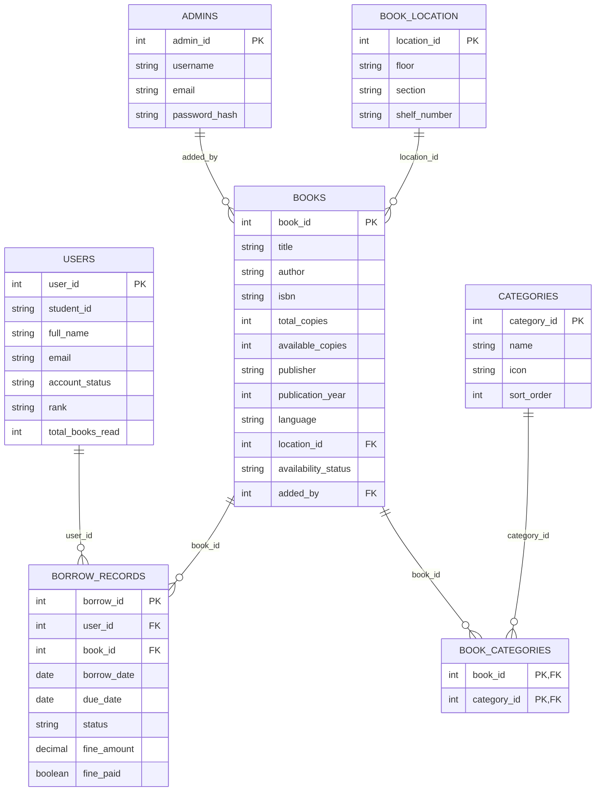

# Smart Library — Database Structure (Upgraded)

The `smart_library` database consists of **7 primary tables**, including the newly designed physical tracking system for book locations.

Below is the complete architectural overview and schema breakdown of the exact live structure as of now.

## Architectural Diagram

---

## Detailed Table Breakdown

### 1. `admins` (Librarians/Staff)
Stores the credentials for the library staff who manage the system.
*   **`admin_id`**: Primary Key
*   **`username`, `email`**: Unique identifiers
*   **`password_hash`**: Securely hashed password

### 2. `users` (Students)
Stores all student records, authentication, and gamification progress.
*   **`user_id`**: Primary Key
*   **`student_id`, `email`**: Unique identifiers
*   **`account_status`**: Active or suspended
*   **`rank`, `badge_icon`, `total_books_read`**: Gamification and tracking stats.

### 3. `books` (Inventory)
The core inventory table for all physical (or digital) books in the library.
*   **`book_id`**: Primary Key
*   **`title`, `author`, `isbn`**: Metadata (Covered by a `FULLTEXT` index for fast searching)
*   **`total_copies`, `available_copies`**: NEW - Tracks physical inventory quantities
*   **`publisher`, `publication_year`, `language`**: NEW - Extended metadata
*   **`location_id`**: NEW - Foreign Key linking to `book_location`
*   **`cover_image_path`, `cover_image_url`**: Paths to the book's cover art
*   **`availability_status`**: `available`, `borrowed`, or `lost`
*   **`added_by`**: Foreign Key referencing the `admin_id` who added it.

### 4. `book_location` (NEW - Physical Shelving)
Tracks the exact physical location of a book inside the library.
*   **`location_id`**: Primary Key
*   **`floor`**: E.g., "1st Floor"
*   **`section`**: E.g., "Science & Tech"
*   **`shelf_number`**: E.g., "Shelf A4"

### 5. `borrow_records` (Transactions)
The transactional ledger tracking every book that is checked out.
*   **`borrow_id`**: Primary Key
*   **`user_id`, `book_id`**: Foreign Keys linking the student to the book
*   **`borrow_date`, `due_date`, `return_date`**: Timeline tracking
*   **`status`**: `borrowed`, `returned`, `overdue`, or `lost`
*   **`fine_amount`, `fine_paid`**: Financial tracking for overdue books.

### 6. `categories` (Genres / Subjects)
Defines the genres/subjects available in the app dashboard.
*   **`category_id`**: Primary Key
*   **`name`**: Genre name (e.g., "Science Fiction")
*   **`icon`**: Flutter Material icon identifier
*   **`sort_order`**: Dashboard display order

### 7. `book_categories` (Junction Table)
Because a single book can belong to multiple categories (e.g., "Science Fiction" and "Technology"), this many-to-many junction table connects them.
*   **`book_id`**: Foreign Key
*   **`category_id`**: Foreign Key
