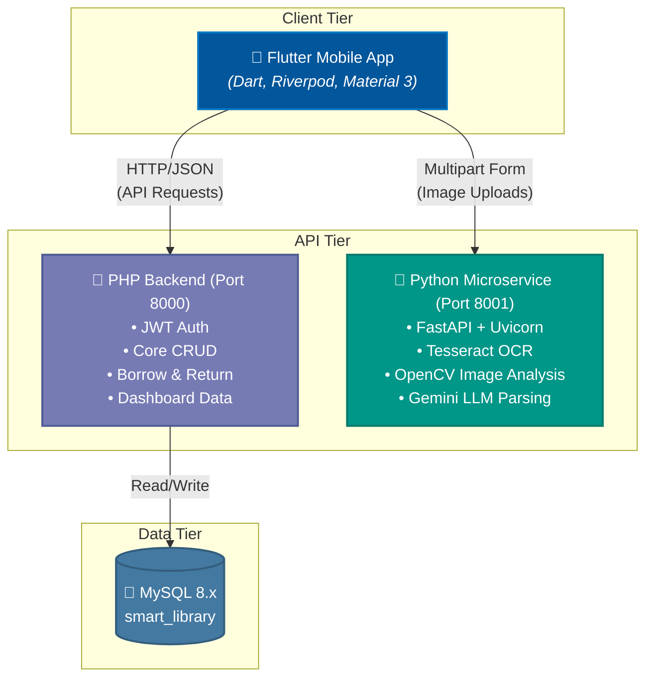
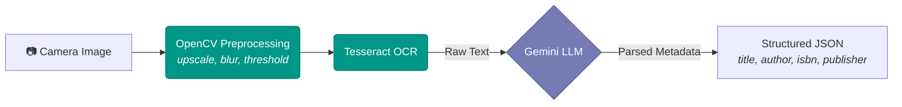

# 📚 Smart Library Management System

> An AI-powered mobile library management application built with **Flutter**, a **PHP REST API** backend, and a **Python FastAPI** computer-vision microservice. Students scan book covers with their phone camera, and the system uses OCR + LLM parsing to auto-populate book metadata — making cataloguing effortless.


---

## 📖 Table of Contents

- [🎯 Project Overview](#-project-overview)
- [🏗 Architecture](#-architecture)
- [🎨 UI/UX Design](#-uiux-design)
- [⚙ Backend — PHP (CRUD & Auth)](#-backend--php-crud--auth)
- [🐍 Backend — Python (AI/Vision)](#-backend--python-aivision)
- [🗄 Database Schema](#-database-schema)
- [📋 Prerequisites](#-prerequisites)
- [🚀 Installation & Setup](#-installation--setup)
- [⚙ Configuration](#-configuration)
- [📱 Usage Guide](#-usage-guide)
- [🧪 Testing](#-testing)
- [🚢 Deployment](#-deployment)
- [🛡 Security & Production Readiness](#-security--production-readiness)
- [🔮 Future Enhancements](#-future-enhancements)
- [📝 Changelog](#-changelog)
- [🤝 Contributing](#-contributing)
- [📄 License](#-license)

---

## 🎯 Project Overview

The **Smart Library Management System** is a full-stack mobile application that digitises library operations for educational institutions. It enables:

- **Students** to browse, search, borrow, and return books via a highly polished mobile UI.
- **Librarians** to manage physical inventory across library floors/shelves, add books by scanning covers (AI-powered OCR), and monitor overdue items.
- **AI-Powered Cataloguing** — point the camera at a book cover and the system automatically extracts the title, author, ISBN, and publisher using Tesseract OCR combined with Google Gemini LLM parsing.

| Feature | Description |
|---|---|
| 📱 Cross-platform Flutter app | Targets Android, iOS, Web, and Desktop. |
| 🔍 AI Book Scanner | OCR + LLM extraction from cover photography. |
| 📚 Physical Shelf Tracking | Maps books to exact physical coordinates (floor, section, shelf). |
| 📊 Dashboard | Real-time analytics, active reads, featured resources. |
| 🔐 Dual-role Auth | Differentiated experiences for Students and Librarians. |
| 🎨 Premium Theming | Modern glassmorphism UI with fluid micro-animations. |

---

## 🏗 Architecture



---

## 🎨 UI/UX Design

- **Framework**: Flutter with Material 3.
- **Typography**: [Google Fonts — Inter](https://fonts.google.com/specimen/Inter) for clean, modern readability.
- **State Management**: [Riverpod](https://riverpod.dev/).
- **Animations**: `animate_do` package.

### App Screens

| Screen | Description |
|---|---|
| Onboarding | Animated walkthrough for first-time users |
| Login | Dual-role login (Student ID / Librarian username) |
| Dashboard | Greeting, search bar, featured carousel, categories, stat cards |
| Scanner | Camera-based book cover scanner with OCR extraction |
| Book Details | Cover art, physical shelf location, availability, editable fields |
| My Library | Borrow history with status chips (Borrowed / Returned / Overdue) |
| Profile | User stats, rank badge, account info |

---

## ⚙ Backend — PHP (CRUD & Auth)

**Architecture**: Vanilla PHP 8.x with PDO MySQL — no framework overhead. Each endpoint is a standalone script dispatched via `?action=` query parameter.

**Server**: PHP built-in development server (`php -S 0.0.0.0:8000`)

### API Endpoints Overview

- `user.php` — Student Authentication & Search
- `admin.php` — Librarian Operations
- `borrow.php` — Checkout & Returns
- `get_dashboard.php` — Dashboard Data
- `book_details.php` — Single Book Details
- `categories.php` — Categories Management

---

## 🐍 Backend — Python (AI/Vision)

**Framework**: FastAPI 0.115 with Uvicorn ASGI server
**Purpose**: Dedicated microservice for AI image processing — fully decoupled from CRUD operations.

### ML Pipeline



---

## 🗄 Database Schema

MySQL 8.x — `smart_library` database with core tables optimized for physical tracking. View the [Database Schema Reference](database_schema_reference.md) for deeper details.

---

## 📋 Prerequisites

| Dependency | Version | Purpose |
|---|---|---|
| Flutter SDK | ≥ 3.12 | Mobile app framework |
| PHP | ≥ 8.0 | CRUD backend |
| Python | ≥ 3.9 | AI/Vision backend |
| MySQL | ≥ 8.0 | Database |
| Tesseract OCR | ≥ 5.0 | Text recognition engine |

---

## 🚀 Installation & Setup

### 1. Database Setup
```bash
mysql -u root -p < backend/current_database_schema.sql
```

### 2. PHP Backend (Port 8000)
```bash
cd backend/php_backend
php -S 0.0.0.0:8000
```

### 3. Python Backend (Port 8001)
```bash
cd backend/py_backend
pip install -r requirements.txt
python main.py
```

### 4. Flutter App
```bash
cd smart_library_app
flutter pub get
flutter run
```

---

## ⚙ Configuration

### Environment Variables
For development, API keys are configured in constants. For production, transition to an `.env` managed setup.

**Flutter App** (`lib/core/app_constants.dart`):
- Android Emulator host: `10.0.2.2`
- iOS Simulator: `127.0.0.1`

---

## 📱 Usage Guide

### Default Credentials
| Role | ID / Username | Password |
|---|---|---|
| Student | `S12345` | `password123` |
| Librarian | `librarian` | `password123` |

---

## 🚢 Deployment

> **Status**: Early Development.

1. **Database**: Migrate to AWS RDS / managed MySQL.
2. **PHP Backend**: Deploy behind Nginx with PHP-FPM.
3. **Python Backend**: Containerize with Docker.
4. **App**: Build release binaries (`flutter build apk`).

---

## 📝 Changelog

- **[July 2026] Documentation Audit**: Completed a comprehensive review and rewrite of all architectural documentation (`README.md`, `critical_analysis.md`, `database_schema_reference.md`, `ocr_workflow.md`, `walkthrough.md`) elevating the technical rigor and precision of the project's documentation suite.
- **[July 2026] Schema Synchronization**: Standardized the transactional ledger table nomenclature to `borrow_records` across the MySQL schema and PHP PDO queries, resolving a previous integration discrepancy.
- **[June 2026] Security & Speed**: Introduced JWT token refresh authentication strategy, `FULLTEXT` indexing on books, and Flutter asset caching layers (`CachedNetworkImage`).
- **[June 2026] Flutter UI Fixes**: Resolved `const` evaluation errors and deprecated `CardTheme` usages to ensure seamless compilation with the latest Flutter SDKs.

---

## 📄 License

This project is licensed under the **MIT License**.

<p align="center">
  Built with ❤️ using Flutter, PHP, FastAPI, and OpenCV
</p>
