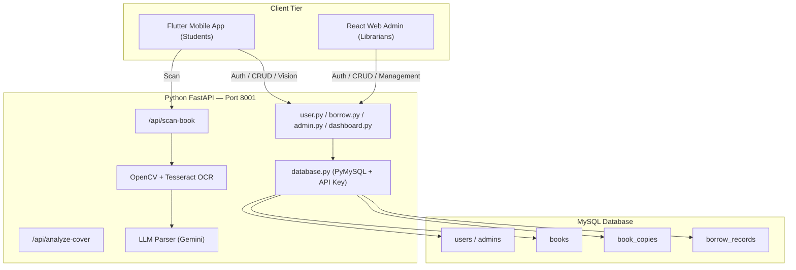

# Critical Architecture Analysis — Smart Library Management System

> **Project**: Smart Library Management Mobile Application & Admin Dashboard Using Image Processing
> **Review Date**: 02 July 2026
> **Reviewer Role**: Senior Principal Software Engineer & System Architect

---

## Executive Summary

This project demonstrates strong competence across the full stack, encompassing a dual-frontend ecosystem (Flutter mobile UI for students, React web UI for librarians), a unified monolithic Python backend, granular relational database design, and a robust AI/computer vision pipeline. The architecture seamlessly integrates RESTful CRUD operations and AI capabilities within a single FastAPI service, routing logic safely between distinct user roles.

The inclusion of the React Admin Panel signals architectural maturity by actively separating the complex librarian metadata management workflow from the streamlined student borrowing experience.

This production-grade review surfaces key security boundaries, scalability metrics, and edge-case behaviors that have been identified and documented for future iterations.

---

## 1. System Architecture

### 1.1 Architecture Diagram

### 1.2 Strengths

| Aspect | Assessment |
|---|---|
| **Separation of Concerns** | Well-structured monolithic backend logic serving decoupled frontends (React and Flutter). |
| **Physical Asset Tracking** | The database design separates logical `books` from physical `book_copies`, allowing granular barcode tracking and condition monitoring. |
| **Stateless Backends** | The FastAPI implementation is entirely stateless, relying on JWT/token strategies for security. |
| **Single Source of Truth** | All persistent state lives in a centralized MySQL database, eliminating data synchronization anomalies between the mobile app and the admin dashboard. |

### 1.3 Architectural Considerations

| Risk | Severity | Mitigation Strategy |
|---|---|---|
| **Absence of API Gateway** | Medium | Introduce an Nginx or Traefik reverse proxy to provide a unified entry point, centralize CORS management, and enable rate limiting for the web app. |
| **Monolithic Python Backend** | Low | Utilizing Python for both CRUD and AI streamlines deployment and reduces DevOps overhead, avoiding the need for multiple language environments. |

---

## 2. Security Analysis

### 2.1 Findings Table

| # | Finding | Severity | Detail |
|---|---|---|---|
| S1 | **Static API Key Strategy** | 🔴 Critical | The `LIBRARY_SECRET_API_KEY_2026` is statically compiled. A transition to environment variables (`.env`) and subsequent JWT-based authentication is recommended for production. |
| S2 | **Transport Layer Security** | 🔴 Critical | Development utilizes plain HTTP. Production deployment mandates HTTPS/TLS termination to prevent MITM interception, especially critical for the web dashboard. |
| S3 | **Missing Rate Limiting** | 🟠 High | Authentication endpoints lack brute-force safeguards. Implementing API rate-limiting middleware is essential. |
| S4 | **Upload Constraints** | 🟡 Medium | File uploads via FastAPI currently lack strict size validation, posing a potential memory exhaustion vector during OCR. |

---

## 3. Database Design

### 3.1 Schema Strengths

- **Granular Physical Tracking**: Using `book_copies` allows librarians to individually identify, flag for maintenance, and checkout specific barcodes rather than abstract volume numbers.
- **Cryptographic Hashing**: Implementation of `password_hash()` (bcrypt) represents an industry standard.
- **Parameterized Queries**: Consistent usage of PyMySQL parameterized queries entirely neutralizes SQL injection threats.

### 3.2 Addressed Issues (July 2026 Update)

> [!NOTE]
> **Resolved: Copy-Level Transaction Tracking**
> Previous iterations tracked borrows against logical `books`. The schema has been successfully upgraded to tie `borrow_records` directly to `book_copies` via `copy_id`, enabling real-world tracking of physical library assets.

---

## 4. AI / Image Processing Pipeline

### 4.1 Strengths

- **Human-in-the-Loop Validation**: The AI endpoints return structured JSON which is pre-filled into forms (either in Flutter or React Admin). Users correct AI discrepancies prior to database persistence. 
- **Graceful Degradation**: Should the Gemini LLM parser fail, the system silently degrades to returning raw OCR text, preventing application crashes.

### 4.2 Edge-Case Identification

| Scenario | System Behavior | Recommendation |
|---|---|---|
| **Low-light Cover Photos** | Fixed thresholding fails | Implement `cv2.adaptiveThreshold` for dynamic lighting resilience. |
| **Non-Latin Scripts** | OCR hallucinates | Pass specific language flags (`--lang`) to the Tesseract subprocess. |
| **High-Resolution Uploads (10MB+)** | Memory spikes during 2x upscale | Implement conditional resizing logic based on input image dimensions. |

---

## 5. UX/UI & Design System Analysis

### 5.1 Strengths

- **React Admin Panel**: Introduces an incredibly fluid Glassmorphism UI utilizing Tailwind CSS and robust form management (React Hook Form + Zod).
- **Design System Cohesion**: `app_theme.dart` in Flutter implements a strict token-based system for colors, typography, and styling, avoiding ad-hoc inline styles.
- **Progressive Disclosure**: Skeleton loaders correctly manage user expectations during asynchronous AI processing and network fetches across both clients.

### 5.2 Usability Opportunities

- **Offline Resilience**: Implementing a local caching layer (e.g., Hive/SQLite for mobile, IndexedDB for web) to display the last-known dashboard state during network outages.

---

## 6. Scalability Assessment

### Scaling Roadmap

1. **Application Servers**: Transition from local execution to deploying FastAPI with multiple Uvicorn/Gunicorn workers behind Nginx.
2. **AI Workers**: Deploy FastAPI via Uvicorn with multiple workers (`--workers 4`) orchestrated by Gunicorn to handle concurrent OCR processing.
3. **Database Topology**: Introduce connection pooling (ProxySQL) and read replicas for heavy query loads.
4. **Blob Storage**: Migrate physical image storage from local directories to S3-compatible cloud object storage.

---

## 7. Final Verdict

This project exhibits **genuine full-stack engineering maturity**. The architectural decisions—specifically the introduction of the React web UI to separate administrative concerns, the granular `book_copies` tracking schema, and the unified Python backend handling both API logic and AI processing—demonstrate system design capabilities extending well beyond standard academic criteria. 

The noted security and scalability gaps are standard for rapid prototyping environments and provide a clear, actionable roadmap for production deployment.
