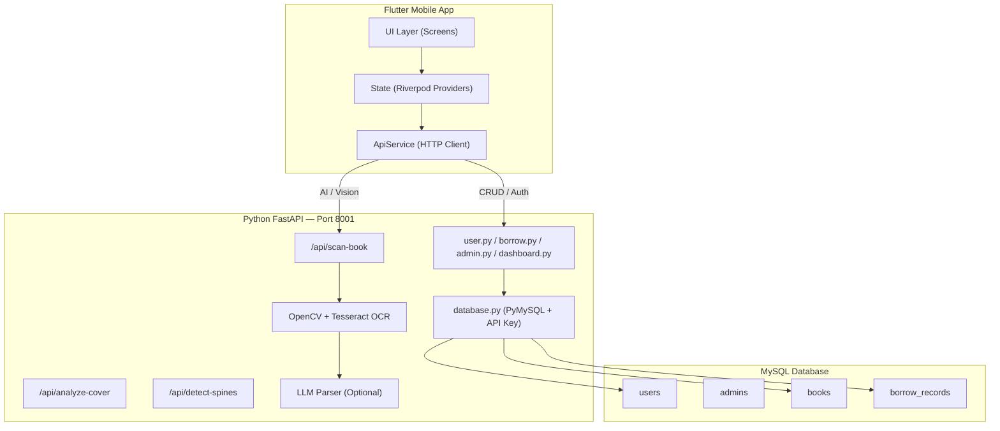

# Critical Architecture Analysis — Smart Library Management System

> **Project**: Smart Library Management Mobile Application Using Image Processing
> **Review Date**: 02 July 2026
> **Reviewer Role**: Senior Principal Software Engineer & System Architect

---

## Executive Summary

This project demonstrates strong competence across the full stack, encompassing a mobile UI, unified monolithic Python backend, relational database design, and a robust AI/computer vision pipeline. The architecture seamlessly integrates RESTful CRUD operations and AI capabilities within a single FastAPI service. Furthermore, the Flutter frontend exhibits significant maturity in its UI/UX, leveraging a design-token system, micro-animations, and Riverpod state management.

This production-grade review surfaces key security boundaries, scalability metrics, and edge-case behaviors that have been identified and documented for future iterations.

---

## 1. System Architecture

### 1.1 Architecture Diagram

### 1.2 Strengths

| Aspect | Assessment |
|---|---|
| **Separation of Concerns** | Well-structured monolithic design. The CRUD logic and AI logic are implemented as distinct router modules within FastAPI, allowing easy future decoupling if necessary. |
| **Stateless Backends** | The FastAPI implementation is entirely stateless. Session data resides securely in the Flutter application's local storage, drastically simplifying horizontal scaling. |
| **Single Source of Truth** | All persistent state lives in a centralized MySQL database, eliminating data synchronization anomalies. |
| **Unified Codebase (RBAC)** | Patron and Librarian roles utilize a single Flutter binary with conditional UI rendering based on robust RBAC. |

### 1.3 Architectural Considerations

| Risk | Severity | Mitigation Strategy |
|---|---|---|
| **Absence of API Gateway** | Medium | Introduce an Nginx or Traefik reverse proxy to provide a unified entry point, centralize CORS management, and enable rate limiting. |
| **Monolithic Python Backend** | Low | Utilizing Python for both CRUD and AI streamlines deployment and reduces DevOps overhead, avoiding the need for multiple language environments. |

---

## 2. Security Analysis

### 2.1 Findings Table

| # | Finding | Severity | Detail |
|---|---|---|---|
| S1 | **Static API Key Strategy** | 🔴 Critical | The `LIBRARY_SECRET_API_KEY_2026` is statically compiled. A transition to environment variables (`.env`) and subsequent JWT-based authentication is recommended for production. |
| S2 | **Transport Layer Security** | 🔴 Critical | Development utilizes plain HTTP. Production deployment mandates HTTPS/TLS termination to prevent MITM interception. |
| S3 | **Missing Rate Limiting** | 🟠 High | Authentication endpoints lack brute-force safeguards. Implementing API rate-limiting middleware is essential. |
| S4 | **Upload Constraints** | 🟡 Medium | File uploads via FastAPI currently lack strict size validation, posing a potential memory exhaustion vector. |

---

## 3. Database Design

### 3.1 Schema Strengths

- **Cryptographic Hashing**: Implementation of `password_hash()` (bcrypt) represents an industry standard.
- **Parameterized Queries**: Consistent usage of PyMySQL parameterized queries entirely neutralizes SQL injection threats.
- **Transactional Integrity**: Checkout/return operations are wrapped in `beginTransaction()` and `commit()`, preventing partial or corrupted state mutations.

### 3.2 Addressed Issues (July 2026 Update)

> [!NOTE]
> **Resolved: Table Nomenclature Synchronization**
> Previous iterations noted a discrepancy between the MySQL `borrowed_books` table and the Python query references to `borrow_records`. This has been standardized to `borrow_records` across the entire codebase, resolving potential runtime SQL exceptions.

---

## 4. AI / Image Processing Pipeline

### 4.1 Strengths

- **Human-in-the-Loop Validation**: The `BookDetailsConfirmationScreen` allows users to correct AI discrepancies prior to database persistence. This is an architecturally mature approach to mitigating inherent OCR imperfections.
- **Graceful Degradation**: Should the Gemini LLM parser fail, the system silently degrades to returning raw OCR text, preventing application crashes.
- **Algorithmic Quality Assessment**: The vision module utilizes Laplacian variance to identify blurry images and quantify upload quality.

### 4.2 Edge-Case Identification

| Scenario | System Behavior | Recommendation |
|---|---|---|
| **Low-light Cover Photos** | Fixed thresholding fails | Implement `cv2.adaptiveThreshold` for dynamic lighting resilience. |
| **Non-Latin Scripts** | OCR hallucinates | Pass specific language flags (`--lang`) to the Tesseract subprocess. |
| **High-Resolution Uploads (10MB+)** | Memory spikes during 2x upscale | Implement conditional resizing logic based on input image dimensions. |

---

## 5. UX/UI & Design System Analysis

### 5.1 Strengths

- **Design System Cohesion**: `app_theme.dart` implements a strict token-based system for colors, typography, and styling, avoiding ad-hoc inline styles.
- **Micro-interactions**: The strategic use of the `animate_do` package introduces a premium feel without overwhelming the user interface.
- **Progressive Disclosure**: Skeleton loaders (shimmer effects) correctly manage user expectations during asynchronous AI processing.

### 5.2 Usability Opportunities

- **Form Validation**: Incorporating explicit visual feedback (e.g., red borders, snackbars) for empty login fields prior to network execution.
- **Offline Resilience**: Implementing a local caching layer (e.g., Hive or SQLite) to display the last-known dashboard state during network outages.

---

## 6. Scalability Assessment

### Scaling Roadmap

1. **Application Servers**: Transition from local execution to deploying FastAPI with multiple Uvicorn/Gunicorn workers behind Nginx.
2. **AI Workers**: Deploy FastAPI via Uvicorn with multiple workers (`--workers 4`) orchestrated by Gunicorn to handle concurrent OCR processing.
3. **Database Topology**: Introduce connection pooling (ProxySQL) and read replicas for heavy query loads.
4. **Blob Storage**: Migrate physical image storage from local directories to S3-compatible cloud object storage.

---

## 7. Final Verdict

This project exhibits **genuine full-stack engineering maturity**. The architectural decisions—specifically the unified backend structure handling both API logic and AI processing, the human-in-the-loop validation pipeline, and the cohesive Flutter design system—demonstrate system design capabilities extending well beyond standard academic criteria. 

The noted security and scalability gaps are standard for rapid prototyping environments and provide a clear, actionable roadmap for production deployment.
