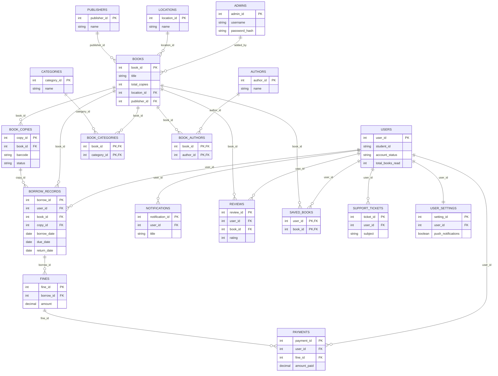

# Database Architecture & Schema Reference

The `smart_library` database is built on a relational architecture. This schema natively supports physical location tracking, individual copy barcode tracking, gamification, and complex many-to-many relationships for categorization. All foreign keys should be properly indexed to ensure query performance across large datasets.

Below is the complete architectural overview and schema breakdown of the production structure, detailing all 18 tables.

---

## Architectural Diagram

---

## Entity Definitions

### 1. `admins` (Librarians & Staff)
Stores the credentials and metadata for library administrators.
*   **`admin_id`**: Primary Key.
*   **`username`, `email`**: Unique identifiers for authentication.
*   **`password_hash`**: Securely hashed password (bcrypt).

### 2. `users` (Students & Patrons)
Stores all patron records, handling authentication states and gamification metrics.
*   **`user_id`**: Primary Key.
*   **`student_id`, `email`**: Unique identifiers.
*   **`account_status`**: Enum (`active` or `suspended`).
*   **`rank`, `total_books_read`**: Gamification and engagement tracking.

### 3. `books` (Global Inventory Catalog)
The core catalog table for all titles within the library network.
*   **`book_id`**: Primary Key.
*   **`title`, `author`, `keywords`**: Core metadata and discovery tags (Optimized with a `FULLTEXT` index for performance).
*   **`total_copies`, `available_copies`**: Aggregated quantities based on linked `book_copies`.
*   **`publisher`, `publication_year`, `language`**: Extended descriptive metadata.
*   **`location_id`, `publisher_id`**: Foreign Keys linking to `locations` and `publishers`.
*   **`cover_image_url`**: Path/URL to the digitized cover art.
*   **`availability_status`**: Enum (`available`, `borrowed`, `lost`).

### 4. `book_copies` (Physical Tracking)
Tracks individual physical items within the library, allowing granular condition and availability monitoring.
*   **`copy_id`**: Primary Key.
*   **`book_id`**: Foreign Key tying the physical item to the logical book metadata.
*   **`barcode`**: Unique identifier (e.g., physical ISBN, RFID, or barcode scan).
*   **`condition`**: Physical state of the item (`New`, `Good`, `Damaged`, etc.).
*   **`status`**: Current physical status (`available`, `borrowed`, `lost`, `maintenance`).

### 5. `locations` (Physical Placement)
Provides logical zoning for physical placement of resources.
*   **`location_id`**: Primary Key.
*   **`name`**: Identifiable name of the physical location (e.g., "Reference Section", "Floor 1 Shelf A").
*   **`description`**: Additional details to guide patrons.

### 6. `borrow_records` (Transactional Ledger)
The immutable ledger tracking all checkouts, returns, and financial penalties.
*   **`borrow_id`**: Primary Key.
*   **`user_id`, `book_id`, `copy_id`**: Foreign Keys linking the transaction actor to the exact physical item.
*   **`borrow_date`, `due_date`, `return_date`**: Chronological tracking points.
*   **`status`**: Enum (`borrowed`, `returned`, `overdue`, `lost`).
*   **`fine_amount`, `fine_paid`**: Financial accountability for overdue resources.

### 7. `categories` & `book_categories` (Taxonomy)
Defines the overarching genres and subjects available in the discovery UI. `book_categories` resolves the many-to-many mapping.
*   **`category_id`**: Primary Key.
*   **`name`**: Genre denomination (e.g., "Science Fiction").
*   **`icon`**: UI icon identifier.

### 8. `authors` & `book_authors` (Attribution)
Stores author biographies and handles the many-to-many relationship with books.

### 9. `publishers` (Publishing Entities)
Tracks unique publishing entities linked to books via `publisher_id`.

### 10. `fines` & `payments` (Financials)
Financial tracking modules. `fines` are generated from overdue `borrow_records`, and `payments` settle those fines via various methods (cash, card, online).

### 11. `reviews` & `saved_books` (Social & Gamification)
Social and gamification features allowing users to rate, review, and bookmark (`saved_books`) items in the catalog.

### 12. `support_tickets` (Help Desk)
Tracks help desk queries raised by users. Status tracking for open/resolved issues.

### 13. `user_settings` (Preferences)
Handles user preferences for notifications and UI theme toggles, linked 1:1 with `users`.

### 14. `notifications` (Alerts)
System alerts sent to users for overdues, fine generation, and general announcements.
