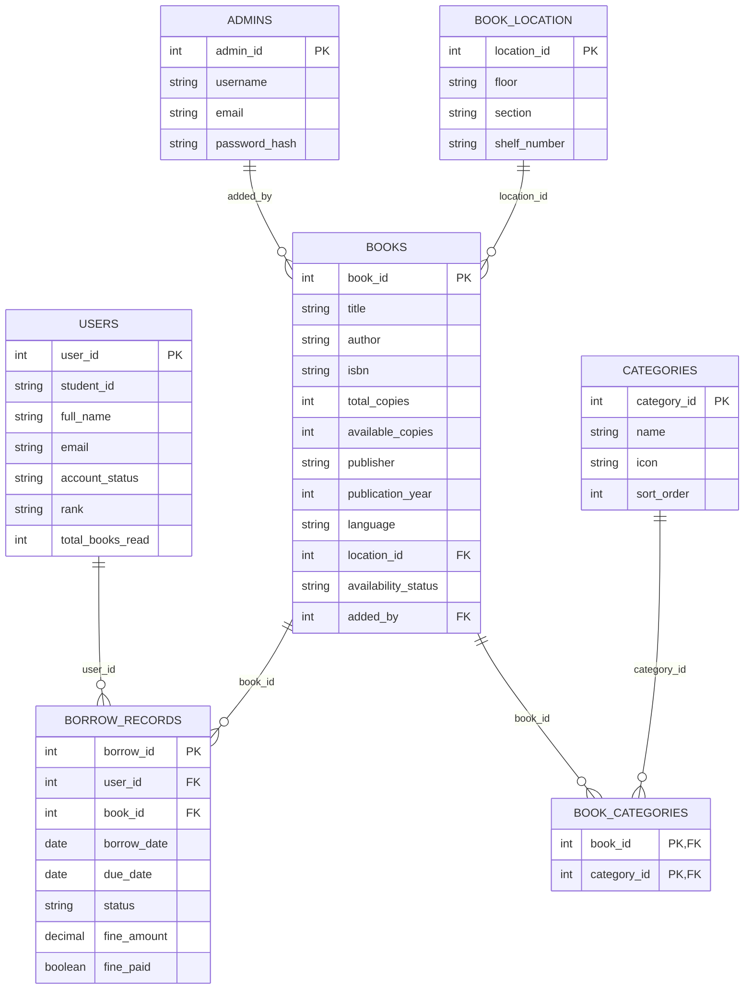

# Database Architecture & Schema Reference

The `smart_library` database is built on a relational architecture, consisting of **7 primary tables**. This schema natively supports physical location tracking, gamification, and complex many-to-many relationships for categorization.

Below is the complete architectural overview and schema breakdown of the production structure.

---

## Architectural Diagram

---

## Entity Definitions

### 1. `admins` (Librarians & Staff)
Stores the credentials and metadata for library administrators.
*   **`admin_id`**: Primary Key.
*   **`username`, `email`**: Unique identifiers for authentication.
*   **`password_hash`**: Securely hashed password (bcrypt).

### 2. `users` (Students & Patrons)
Stores all patron records, handling authentication states and gamification metrics.
*   **`user_id`**: Primary Key.
*   **`student_id`, `email`**: Unique identifiers.
*   **`account_status`**: Enum (`active` or `suspended`).
*   **`rank`, `total_books_read`**: Gamification and engagement tracking.

### 3. `books` (Global Inventory)
The core catalog table for all titles within the library network.
*   **`book_id`**: Primary Key.
*   **`title`, `author`, `isbn`**: Core metadata (Optimized with a `FULLTEXT` index for performance).
*   **`total_copies`, `available_copies`**: Tracks physical inventory quantities.
*   **`publisher`, `publication_year`, `language`**: Extended descriptive metadata.
*   **`location_id`**: Foreign Key linking to `book_location` for shelf tracking.
*   **`cover_image_url`**: Path/URL to the digitized cover art.
*   **`availability_status`**: Enum (`available`, `borrowed`, `lost`).
*   **`added_by`**: Foreign Key referencing `admin_id`.

### 4. `book_location` (Physical Shelving)
Provides high-granularity tracking for the physical placement of resources.
*   **`location_id`**: Primary Key.
*   **`floor`**: Physical floor (e.g., "1st Floor").
*   **`section`**: Logical section (e.g., "Science & Tech").
*   **`shelf_number`**: Specific shelf designation (e.g., "Shelf A4").

### 5. `borrow_records` (Transactional Ledger)
The immutable ledger tracking all checkouts, returns, and financial penalties.
*   **`borrow_id`**: Primary Key.
*   **`user_id`, `book_id`**: Foreign Keys defining the transaction actors.
*   **`borrow_date`, `due_date`, `return_date`**: Chronological tracking points.
*   **`status`**: Enum (`borrowed`, `returned`, `overdue`, `lost`).
*   **`fine_amount`, `fine_paid`**: Financial accountability for overdue resources.

### 6. `categories` (Taxonomy)
Defines the overarching genres and subjects available in the discovery UI.
*   **`category_id`**: Primary Key.
*   **`name`**: Genre denomination (e.g., "Science Fiction").
*   **`icon`**: UI icon identifier.
*   **`sort_order`**: Deterministic display ordering for the dashboard.

### 7. `book_categories` (Junction Table)
Resolves the many-to-many relationship between books and categories.
*   **`book_id`**: Foreign Key.
*   **`category_id`**: Foreign Key.
