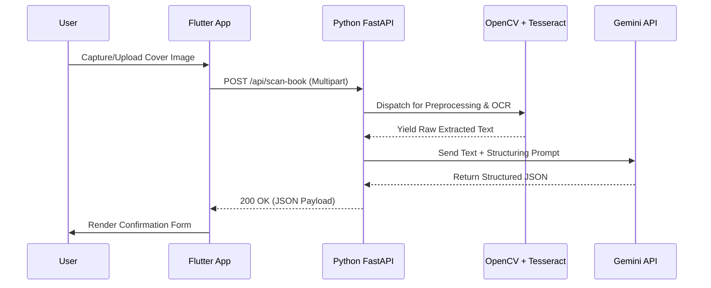

# 🔍 AI Book Scanner & OCR Workflow Architecture

This document outlines the end-to-end architecture and data flow for the AI-powered book scanner, detailing the integration between the Flutter mobile application and the Python (FastAPI) backend.

---

## 📱 1. Mobile Client (Flutter)
The scanning process is initiated from the `ScannerScreen` within the mobile application.

*   **Image Acquisition**: Utilizes the `image_picker` package, allowing users to capture a live photo (`ImageSource.camera`) or select an existing image (`ImageSource.gallery`).
*   **Service Invocation**: The application triggers `ApiService.extractBookInfo(image.path)`.
*   **Payload Transmission**: The image is packaged as a `multipart/form-data` HTTP POST request. It is securely transmitted to the FastAPI backend (port `8001`), authenticated via the `X-API-Key` header.

## 🐍 2. Backend Service (FastAPI)
The request is processed by the dedicated AI microservice endpoint: `POST /api/scan-book`.

*   **Ingestion**: FastAPI receives the raw image payload into memory.
*   **Routing**: The payload is immediately dispatched to the Computer Vision pipeline for synchronous processing.

## 👁️ 3. OCR Preprocessing & Extraction (`ocr_engine.py`)
To maximize optical character recognition (OCR) accuracy, the raw image undergoes extensive preprocessing.

*   **Image Conditioning (OpenCV)**: The image is upscaled (2x interpolation), converted to grayscale, subjected to bilateral filtering to reduce noise while preserving edges, and adaptively thresholded into a binary format.
*   **Text Extraction (Tesseract)**: The conditioned image is processed by Tesseract OCR (utilizing Page Segmentation Mode 6). This yields a raw, unstructured string of text encompassing all visible characters, including publisher logos and peripheral text.

## 🧠 4. Semantic Parsing (`llm_parser.py`)
The raw OCR output is highly unstructured. Semantic parsing is required to extract meaningful metadata.

*   **LLM Inference (Gemini)**: The raw text is transmitted to the Google Gemini API with a deterministic prompt: *"You are an OCR Post-Processing AI. Extract ONLY the book title and author from this messy text and return it as JSON."*
*   **Data Structuring**: The LLM filters out extraneous information and returns a strictly formatted JSON object (e.g., `{"title": "Harry Potter", "author": "J.K. Rowling"}`).

## 📲 5. Client Resolution & UI Update
*   **Response**: The Python backend persists the cover image to the local `uploads/` directory and returns the structured JSON with a `200 OK` status.
*   **State Update**: The Flutter app receives the payload, dismisses the loading state, and navigates to the `BookDetailsConfirmationScreen`.
*   **Human-in-the-Loop Validation**: The form is pre-filled with the extracted metadata. The librarian can review, manually correct any anomalies, and finalize the entry, which is then persisted via the PHP CRUD backend.

---

### 🗺️ Visual Architecture Diagram

