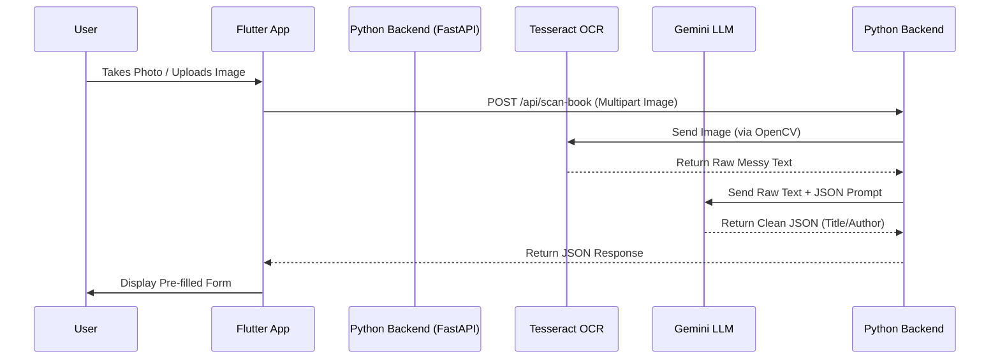

# 🔍 AI Book Scanner & OCR Workflow

You asked how the scanner connects from the mobile app to the Python backend to extract text. The great news is that **this is already fully implemented in your codebase!** 

Here is the exact step-by-step workflow of how a user scans a cover and how it gets processed by the AI.

---

## 📱 1. The Mobile Frontend (`ScannerScreen.dart`)
When the librarian taps the floating action button to add a book, they are taken to the `ScannerScreen`.

*   **Image Selection**: The app uses the `image_picker` package. The user can either tap **"Take a Photo"** (`ImageSource.camera`) or **"Upload from Gallery"** (`ImageSource.gallery`).
*   **API Call**: Once an image is selected, the app calls `ApiService.extractBookInfo(image.path)`.
*   **Network Request**: The Flutter app packages the image into a **Multipart HTTP POST request** and sends it to the Python backend running on port `8001`, along with the `X-API-Key` for security.

## 🐍 2. The Python Backend (`main.py`)
The request arrives at the FastAPI endpoint: `POST /api/scan-book`.

*   **Reception**: The FastAPI server receives the raw image bytes in memory.
*   **Routing**: It immediately routes the image bytes to the Computer Vision modules.

## 👁️ 3. OCR Preprocessing & Extraction (`ocr_engine.py`)
Before we can read the text, we have to clean the image so the OCR engine can understand it.

*   **OpenCV Preprocessing**: The image is upscaled by 2x, converted to Grayscale, blurred to remove camera noise, and thresholded into pure black-and-white.
*   **Tesseract OCR**: The cleaned image is passed to `tesseract.exe` (using Page Segmentation Mode 6). Tesseract scans the cover and spits out a giant string of raw text (including publisher logos, barcodes, random quotes, etc.).

## 🧠 4. LLM Data Parsing (`llm_parser.py`)
Tesseract gives us raw, messy text. We need to figure out which part is the title and which part is the author.

*   **Gemini AI**: The raw OCR text is sent to the Google Gemini API with a strict prompt: *"You are an OCR Post-Processing AI. Extract ONLY the book title and author from this messy text and return it as JSON."*
*   **Structuring**: Gemini ignores the junk (like "New York Times Bestseller") and returns a clean JSON object: `{"title": "Harry Potter", "author": "J.K. Rowling"}`.

## 📲 5. Returning to the App
*   The Python backend takes the clean JSON, saves the cover image to the `uploads/` folder, and sends a `200 OK` response back to the Flutter app.
*   The Flutter app receives the response, stops the loading animation, and navigates to the **`BookDetailsConfirmationScreen`**.
*   The text fields on this screen are automatically pre-filled with the AI-extracted Title and Author, and the cover image is displayed at the top. The librarian can review it, tweak it if the AI made a typo, and hit **Save** to send it to the PHP backend!

---

### 🗺️ Visual Architecture Diagram

