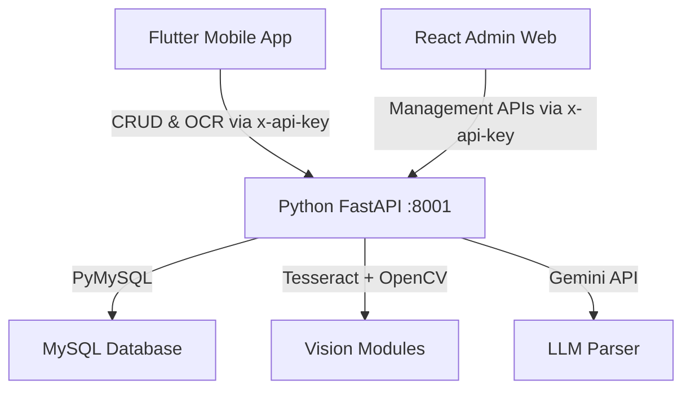

# Smart Library Management System — Walkthrough

## 1. Architecture Overview



## 2. Database Schema

Defined in `backend/current_database_schema.sql`.

| Entity | Purpose | Key Mechanisms |
|---|---|---|
| `admins` | Administrative access | bcrypt password hashing |
| `users` | Patron accounts | `account_status` ENUM for soft bans |
| `books` | Master catalog metadata | `FULLTEXT` indices, FK to admins/locations |
| `book_copies` | Physical copy tracking | Unique barcode tracking per physical item |
| `borrow_records` | Transaction history | Linked to specific `copy_id`, due date computations |
| `categories` | Book taxonomy | Managed hierarchically for UI discovery |
| `locations` | Physical placement | Zones/shelving coordinate tracking |
| `authors` / `publishers` | Deep catalog metadata | Normalization of book entities |
| `fines` / `payments` | Financial accountability | Tracks overdue penalties and settlements |
| `reviews` / `saved_books` | Social features | Patron gamification and bookmarks |
| `support_tickets` | Help desk | Patron support queries |
| `notifications` | Alerts | Overdue and fine system alerts |

*Note: Seed data is provided in `backend/sample_data.sql` for rapid local provisioning.*

---

## 3. Python FastAPI Backend (Port 8001)

Unified monolithic backend (`main.py`) handling both RESTful CRUD operations and AI/Vision tasks for the dual-frontend ecosystem.

| Router / Endpoint | Purpose | Subsystems |
|---|---|---|
| `user.py`, `borrow.py`, `admin.py`, `dashboard.py`, `settings.py`, `locations.py` | Core CRUD operations, authentication, and data aggregation | PyMySQL database queries |
| `POST /api/scan-book` | OCR and structured metadata extraction | `ocr_engine.py` + `llm_parser.py` |
| `POST /api/analyze-cover` | Cover quality, dominant color mapping | `feature_matcher.py` |
| `POST /api/detect-spines` | Shelf spatial analysis and spine detection | `feature_matcher.py` |

### Vision Subsystems
- **`ocr_engine.py`**: Handles OpenCV preprocessing (grayscale, bilateral filtering, adaptive thresholding) prior to Tesseract OCR execution.
- **`feature_matcher.py`**: Implements ORB keypoint extraction, K-means color clustering, Laplacian blur evaluation, and contour detection.
- **`llm_parser.py`**: Interfaces with the Gemini API to structure raw OCR noise into deterministic JSON payloads.

---

## 4. Frontend Ecosystem

### A. React Admin Panel (Librarians)
A fully functional administrative dashboard.
- **Framework**: React 19 + Vite.
- **Styling**: Tailwind CSS ensuring a responsive, Glassmorphism-inspired aesthetic.
- **Capabilities**: Inventory tracking, multi-copy barcode assignment, location tracking, and real-time dashboard analytics.

### B. Flutter Mobile Application (Students)
A streamlined application optimized for discovery and borrowing.
- **State Management**: Utilizes Riverpod for reactive state.
- **Design System**: A cohesive visual language enforced via `app_theme.dart`.
- **Capabilities**: Book search via `FULLTEXT`, borrowing operations, gamification profile, and OCR camera scanning.

---

## 5. Deployment & Verification

### Local Provisioning Guide

```bash
# 1. Database Initialization
mysql -u root -p < backend/current_database_schema.sql
mysql -u root -p smart_library < backend/sample_data.sql

# 2. Start Python Service (Terminal 1)
cd backend/py_backend
pip install -r requirements.txt
# Ensure you configure your .env file with API_KEY and DB credentials
python main.py

# 3. Launch React Admin Panel (Terminal 2)
cd admin-panel
npm install
npm run dev

# 4. Launch Flutter Client (Terminal 3)
cd smart_library_app
flutter run
```

### System Health Checks

| Vector | Status |
|---|---|
| Admin Panel Build | ✅ Typescript compiling without errors |
| `flutter analyze` | ✅ Zero issues reported |
| Dependency Graph | ✅ Fully resolved across NPM and Pub |
| API Authentication | ✅ Enforced globally via `x-api-key` |
| Role-Based Access | ✅ Segregated UI endpoints (React Admin vs Flutter App) |

---

## 6. Change Log

- **[July 2026] Dual-Frontend & Architecture**: Introduced the React Admin Panel, transitioned to physical copy tracking (`book_copies`), and unified all API calls into the robust Python FastAPI backend. Completed a comprehensive update of all related system documentation.
- **[July 2026] Keyword Search Enhancement**: Added custom keyword/tagging system for books. Expanded database `FULLTEXT` indexing, updated FastAPI backend SQL queries, and added new interactive UI fields to the React Admin Panel for enhanced book discovery.
