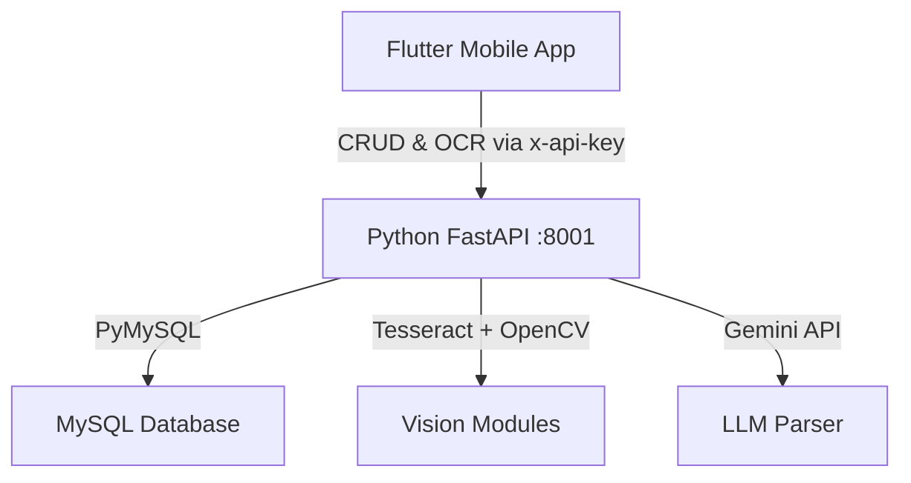

# Smart Library Management System — Walkthrough

## 1. Architecture Overview



## 2. Database Schema

Defined in `backend/database_schema.sql`.

| Entity | Purpose | Key Mechanisms |
|---|---|---|
| `admins` | Administrative access | bcrypt password hashing |
| `users` | Patron accounts | `account_status` ENUM for soft bans |
| `books` | Master catalog | `FULLTEXT` indices, FK to admins/locations |
| `borrow_records` | Transaction history | Due date computations, cascade configurations |

*Note: Seed data is provided in `backend/sample_data.sql` for rapid local provisioning.*

---

## 3. Python FastAPI Backend (Port 8001)

Unified monolithic backend (`main.py`) handling both RESTful CRUD operations and AI/Vision tasks.

| Router / Endpoint | Purpose | Subsystems |
|---|---|---|
| `user.py`, `borrow.py`, `admin.py`, `dashboard.py`, `settings.py` | Core CRUD operations, authentication, and data aggregation | PyMySQL database queries |
| `POST /api/scan-book` | OCR and structured metadata extraction | `ocr_engine.py` + `llm_parser.py` |
| `POST /api/analyze-cover` | Cover quality, dominant color mapping | `feature_matcher.py` |
| `POST /api/detect-spines` | Shelf spatial analysis and spine detection | `feature_matcher.py` |

### Vision Subsystems
- **`ocr_engine.py`**: Handles OpenCV preprocessing (grayscale, bilateral filtering, adaptive thresholding) prior to Tesseract OCR execution.
- **`feature_matcher.py`**: Implements ORB keypoint extraction, K-means color clustering, Laplacian blur evaluation, and contour detection.
- **`llm_parser.py`**: Interfaces with the Gemini API to structure raw OCR noise into deterministic JSON payloads.

---

## 4. Flutter Application

### Core Architecture
- **State Management**: Utilizes Riverpod for reactive state (e.g., `AuthNotifier` for sessions, `FutureProvider` for asynchronous network requests).
- **API Client**: A unified API service managing distinct base URLs for the PHP and Python microservices.
- **Design System**: A cohesive glassmorphism visual language enforced via `app_theme.dart`.

### Screen Topology

| Screen | Core Functionality |
|---|---|
| **Onboarding** | Sequential feature introduction with persistent flags |
| **Login** | Dual-role authentication gateway with error state handling |
| **Main** | Scaffold with `IndexedStack` and primary navigation |
| **Dashboard** | Real-time aggregate metrics and personalized active reads |
| **Library** | Context-aware inventory views (Patron vs. Admin) |
| **Scanner** | Hardware camera integration with AI processing states |
| **Confirmation** | Human-in-the-loop metadata validation post-OCR |
| **Profile** | Gamification ranks, settings, and session termination |
| **Search** | Debounced `FULLTEXT` catalog querying |

---

## 5. Deployment & Verification

### Local Provisioning Guide

```bash
# 1. Database Initialization
mysql -u root -p < backend/database_schema.sql
mysql -u root -p smart_library < backend/sample_data.sql

# 2. Start Python Service (Terminal 1)
cd backend/py_backend
pip install -r requirements.txt
python main.py

# 3. Launch Flutter Client (Terminal 2)
cd smart_library_app
flutter run
```

### System Health Checks

| Vector | Status |
|---|---|
| `flutter analyze` | ✅ Zero issues reported |
| Dependency Graph | ✅ Fully resolved (`flutter pub get`) |
| API Authentication | ✅ Enforced globally via `x-api-key` |
| Role-Based Access | ✅ Segregated endpoints (`user.py` vs `admin.py`) |

---

## 6. Change Log

- **[July 2026] Documentation & Architecture**: Completed comprehensive documentation pass. Standardized schema nomenclature and documented UI compatibility updates for modern Flutter SDKs.
