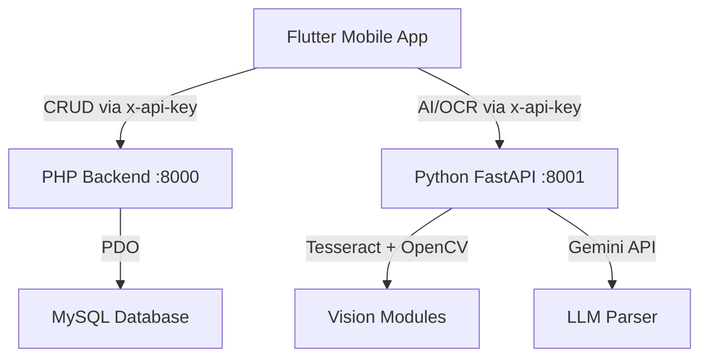

# Smart Library Management System — Walkthrough

## Architecture Overview



## Database Schema

Created in [database_schema.sql](file:///d:/Projects/Smart-Library-Management-System/backend/database_schema.sql):

| Table | Purpose | Key Features |
|---|---|---|
| `admins` | Librarian accounts | bcrypt password hash |
| `users` | Student accounts | `account_status` ENUM (active/suspended) |
| `books` | Book catalog | `availability_status` ENUM, `added_by` FK to admins |
| `borrow_records` | Loan tracking | `due_date`, `days_left` computed, cascade deletes |

Seed data in [sample_data.sql](file:///d:/Projects/Smart-Library-Management-System/backend/sample_data.sql): 1 librarian, 3 students, 8 classic books, 2 borrow records.

---

## PHP Backend (Port 8000)

All endpoints secured with `x-api-key: smartlib-secure-key-2026` via [db_connect.php](file:///d:/Projects/Smart-Library-Management-System/backend/php_backend/api/db_connect.php).

| File | Endpoints | Actions |
|---|---|---|
| [user.php](file:///d:/Projects/Smart-Library-Management-System/backend/php_backend/api/user.php) | `?action=login\|profile\|search` | Student auth, profile stats, book search |
| [admin.php](file:///d:/Projects/Smart-Library-Management-System/backend/php_backend/api/admin.php) | `?action=login\|add_book\|update_book\|all_books\|all_users\|toggle_user` | Librarian CRUD |
| [borrow.php](file:///d:/Projects/Smart-Library-Management-System/backend/php_backend/api/borrow.php) | `?action=borrow\|return\|history` | Transactional checkout/return |
| [get_dashboard.php](file:///d:/Projects/Smart-Library-Management-System/backend/php_backend/api/get_dashboard.php) | `?action=stats\|user_dashboard` | Aggregate + per-user stats |
| [book_details.php](file:///d:/Projects/Smart-Library-Management-System/backend/php_backend/api/book_details.php) | `?book_id=` | Book info + borrow history |

---

## Python FastAPI Backend (Port 8001)

[main.py](file:///d:/Projects/Smart-Library-Management-System/backend/py_backend/main.py) — AI/Vision only, no DB access.

| Endpoint | Purpose | Modules Used |
|---|---|---|
| `POST /api/scan-book` | OCR + LLM structured extraction | `ocr_engine.py` + `llm_parser.py` |
| `POST /api/analyze-cover` | Image quality + dominant colors + features | `feature_matcher.py` |
| `POST /api/detect-spines` | Shelf scanning — detect spine bounding boxes | `feature_matcher.py` |

Vision modules:
- [ocr_engine.py](file:///d:/Projects/Smart-Library-Management-System/backend/py_backend/vision_modules/ocr_engine.py): OpenCV preprocessing (grayscale, bilateral filter, thresholding) → Tesseract OCR
- [feature_matcher.py](file:///d:/Projects/Smart-Library-Management-System/backend/py_backend/vision_modules/feature_matcher.py): ORB keypoints, K-means dominant colors, Laplacian blur detection, contour-based spine detection
- [llm_parser.py](file:///d:/Projects/Smart-Library-Management-System/backend/py_backend/vision_modules/llm_parser.py): Gemini API structured parsing of raw OCR text

---

## Flutter App

### Core Architecture
- **State Management**: [Riverpod providers](file:///d:/Projects/Smart-Library-Management-System/smart_library_app/lib/providers/providers.dart) — AuthNotifier with session persistence, FutureProviders for all data
- **API Service**: [Dual-backend service](file:///d:/Projects/Smart-Library-Management-System/smart_library_app/lib/services/api_service.dart) — PHP CRUD on `:8000`, Python AI on `:8001`
- **Design System**: [app_theme.dart](file:///d:/Projects/Smart-Library-Management-System/smart_library_app/lib/core/app_theme.dart) — Glassmorphism dark theme, Google Fonts Inter

### Screens (9 total)

| Screen | Key Features |
|---|---|
| [Onboarding](file:///d:/Projects/Smart-Library-Management-System/smart_library_app/lib/screens/onboarding_screen.dart) | 3-step PageView, animated dot indicators, shown once |
| [Login](file:///d:/Projects/Smart-Library-Management-System/smart_library_app/lib/screens/login_screen.dart) | Hero glow icon, gradient button, error display, demo hint |
| [Main](file:///d:/Projects/Smart-Library-Management-System/smart_library_app/lib/screens/main_screen.dart) | IndexedStack, center-docked purple FAB with pulse, BottomAppBar |
| [Dashboard](file:///d:/Projects/Smart-Library-Management-System/smart_library_app/lib/screens/dashboard_screen.dart) | Dynamic greeting, 3 stat cards, active reads horizontal scroll |
| [Library](file:///d:/Projects/Smart-Library-Management-System/smart_library_app/lib/screens/library_screen.dart) | Student borrows vs Librarian inventory, pull-to-refresh |
| [Scanner](file:///d:/Projects/Smart-Library-Management-System/smart_library_app/lib/screens/scanner_screen.dart) | Viewfinder with scan line, camera/gallery, shimmer processing |
| [Confirmation](file:///d:/Projects/Smart-Library-Management-System/smart_library_app/lib/screens/book_details_confirmation_screen.dart) | AI-prefilled form, "AI" badges, raw OCR collapsible, success animation |
| [Profile](file:///d:/Projects/Smart-Library-Management-System/smart_library_app/lib/screens/profile_screen.dart) | Avatar initials, stat tiles, settings list, red logout |
| [Search](file:///d:/Projects/Smart-Library-Management-System/smart_library_app/lib/screens/search_results_screen.dart) | Auto-focus, 400ms debounce, BookCard results |

### Widgets (5 reusable components)
- `GlassCard` — Backdrop blur + border + shadow
- `BookCard` — Cover placeholder, title, author, dates, status chip
- `StatCard` — Dashboard metrics with accent glow
- `StatusChip` — Color-coded available/borrowed/overdue/returned
- `SearchBarWidget` — Pinned glass search with filter icon

---

## Verification

| Check | Result |
|---|---|
| `flutter pub get` | ✅ 70 dependencies resolved |
| `flutter analyze` | ✅ **No issues found** |
| API key auth | ✅ Matching `smartlib-secure-key-2026` on both backends |
| RBAC | ✅ Student login via `user.php`, Librarian via `admin.php` |

## How to Run

```bash
# 1. Database
mysql -u root -p < backend/database_schema.sql
mysql -u root -p smart_library < backend/sample_data.sql

# 2. PHP Backend (port 8000)
cd backend/php_backend/api
php -S localhost:8000

# 3. Python Backend (port 8001)
cd backend/py_backend
pip install -r requirements.txt
python main.py

# 4. Flutter App
cd smart_library_app
flutter run
```
